# Home Assistant Automation System Documentation

> **Comprehensive guide to the automation workflows that orchestrate intelligent behavior across 146+ automation files.**

## Table of Contents

1. [System Overview](#system-overview)
2. [Architecture](#architecture)
3. [Understanding the System](#understanding-the-system)
4. [Core Automation Systems](#core-automation-systems)
   - [Presence Detection](#1-presence-detection-system)
   - [Zone Transitions](#2-zone-transition-system)
   - [Time-Based Routines](#3-time-based-routines)
   - [Manual Override](#4-manual-override-system)
5. [Device-Specific Automations](#device-specific-automations)
6. [Environmental Monitoring](#environmental-monitoring-and-safety)
7. [System Integration](#system-integration-and-dependencies)
8. [Statistics & Metrics](#statistics-and-metrics)
9. [Design Patterns](#automation-design-patterns)
10. [Reference](#reference)

---

## System Overview

This Home Assistant installation implements a **sophisticated, multi-layered automation system** designed to provide seamless smart home experiences while maintaining user control and system reliability. The system is built on three foundational principles:

1. **Intelligent Automation**: Presence-aware, context-sensitive behaviors that adapt to occupancy and time of day
2. **User Sovereignty**: Manual override mechanisms that respect user preferences and disable conflicting automations
3. **Reliability & Safety**: Environmental monitoring, fail-safes, and graceful degradation

### Package Organization

The automation system is hierarchically organized across **146+ automation files**:

| Category | Count | Description |
|----------|-------|-------------|
| **Area-Specific** | ~115 | Bedroom, Living Room, Kitchen, Bathroom, Hallway, Storage Room, Apartment |
| **Domain-Level** | ~20 | Cross-cutting concerns (zones, adaptive lighting, vacuum, updates, climate) |
| **Common/Shared** | ~5 | Shared presence and climate logic |
| **Reminders** | ~3 | Time-based personal reminders (brush teeth, water plants, tasks) |
| **User-Specific** | ~2 | Person-specific triggers (andrew_home, andrew_away) |

---

## Architecture

### System Architecture Overview

The automation system follows a layered architecture with clear separation of concerns:

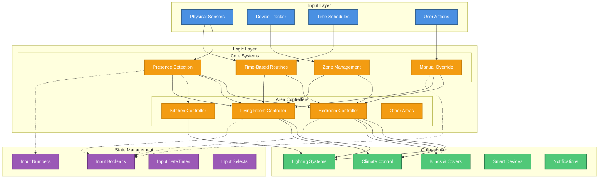
```mermaid
graph TB
    subgraph "Input Layer"
        Sensors[Physical Sensors]
        DeviceTracker[Device Tracker]
        TimeSchedule[Time Schedules]
        UserInput[User Actions]
    end
    
    subgraph "Logic Layer"
        subgraph "Core Systems"
            Presence[Presence Detection]
            Zones[Zone Management]
            TimeRoutines[Time-Based Routines]
            Manual[Manual Override]
        end
        
        subgraph "Area Controllers"
            Bedroom[Bedroom Controller]
            Living[Living Room Controller]
            Kitchen[Kitchen Controller]
            Other[Other Areas]
        end
    end
    
    subgraph "Output Layer"
        Lights[Lighting Systems]
        Climate[Climate Control]
        Covers[Blinds & Covers]
        Devices[Smart Devices]
        Notifications[Notifications]
    end
    
    subgraph "State Management"
        InputBooleans[Input Booleans]
        InputNumbers[Input Numbers]
        InputDateTimes[Input DateTimes]
        InputSelects[Input Selects]
    end
    
    Sensors --> Presence
    Sensors --> TimeRoutines
    DeviceTracker --> Zones
    TimeSchedule --> TimeRoutines
    UserInput --> Manual
    
    Presence --> Bedroom
    Presence --> Living
    Presence --> Kitchen
    Zones --> Bedroom
    TimeRoutines --> Bedroom
    Manual --> Bedroom
    
    Presence --> Living
    Zones --> Living
    TimeRoutines --> Living
    Manual --> Living
    
    Bedroom --> Lights
    Bedroom --> Climate
    Bedroom --> Covers
    Living --> Lights
    Living --> Climate
    Kitchen --> Lights
    
    Bedroom -.-> InputBooleans
    Living -.-> InputBooleans
    Manual -.-> InputBooleans
    Presence -.-> InputNumbers
    
    classDef inputClass fill:#4A90E2,stroke:#2E5C8A,stroke-width:2px,color:#fff
    classDef logicClass fill:#F39C12,stroke:#C87F0A,stroke-width:2px,color:#fff
    classDef outputClass fill:#50C878,stroke:#2E7D4E,stroke-width:2px,color:#fff
    classDef stateClass fill:#9B59B6,stroke:#6C3483,stroke-width:2px,color:#fff
    
    class Sensors,DeviceTracker,TimeSchedule,UserInput inputClass
    class Presence,Zones,TimeRoutines,Manual,Bedroom,Living,Kitchen,Other logicClass
    class Lights,Climate,Covers,Devices,Notifications outputClass
    class InputBooleans,InputNumbers,InputDateTimes,InputSelects stateClass
```

### Package Structure

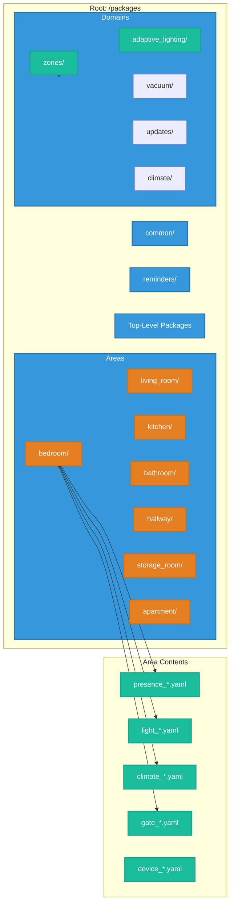
```mermaid
graph LR
    subgraph "Root: /packages"
        Areas[areas/]
        Domains[domains/]
        Common[common/]
        Reminders[reminders/]
        TopLevel[Top-Level Packages]
    end
    
    subgraph "Areas"
        Bedroom[bedroom/]
        LivingRoom[living_room/]
        Kitchen[kitchen/]
        Bathroom[bathroom/]
        Hallway[hallway/]
        StorageRoom[storage_room/]
        Apartment[apartment/]
    end
    
    subgraph "Area Contents"
        PresenceAuto[presence_*.yaml]
        LightAuto[light_*.yaml]
        ClimateAuto[climate_*.yaml]
        GateAuto[gate_*.yaml]
        DeviceAuto[device_*.yaml]
    end
    
    subgraph "Domains"
        ZoneDomain[zones/]
        AdaptiveLighting[adaptive_lighting/]
        VacuumDomain[vacuum/]
        UpdatesDomain[updates/]
        ClimateDomain[climate/]
    end
    
    Areas --> Bedroom
    Areas --> LivingRoom
    Areas --> Kitchen
    Bedroom --> PresenceAuto
    Bedroom --> LightAuto
    Bedroom --> ClimateAuto
    Bedroom --> GateAuto
    
    Domains --> ZoneDomain
    Domains --> AdaptiveLighting
    Domains --> VacuumDomain
    
    classDef categoryClass fill:#3498DB,stroke:#2874A6,stroke-width:2px,color:#fff
    classDef areaClass fill:#E67E22,stroke:#CA6F1E,stroke-width:2px,color:#fff
    classDef fileClass fill:#1ABC9C,stroke:#17A589,stroke-width:2px,color:#fff
    
    class Areas,Domains,Common,Reminders,TopLevel categoryClass
    class Bedroom,LivingRoom,Kitchen,Bathroom,Hallway,StorageRoom,Apartment areaClass
    class PresenceAuto,LightAuto,ClimateAuto,GateAuto,DeviceAuto,ZoneDomain,AdaptiveLighting fileClass
```

---

## Understanding the System

### How It Works: A High-Level View

The automation system operates on a **trigger → condition → action** paradigm with sophisticated state management:

1. **Sensors Detect Events**: Physical sensors (motion, temperature, door contacts) and virtual sensors (time, zone changes) detect state changes
2. **Conditions Evaluate Context**: Automations check if actions should proceed based on helper states, time conditions, or other sensors
3. **Actions Execute**: Lights turn on/off, climate adjusts, notifications send, devices control
4. **State Updates**: Helper entities (input_boolean, input_number) track system state for future automation decisions

### Key Concepts

#### Presence Detection
The system uses **sensor fusion** to determine room occupancy:
- **Radar sensors (LD2410C)**: Millimeter-wave radar detects movement and stillness across 9 distance zones (gates)
- **PIR motion sensors**: Traditional infrared motion detection for quick responses
- **Gate logic**: Tracks which distance zone last had movement for fine-grained presence awareness

#### Manual Mode
When you manually control a device (e.g., turn on a light), the system:
1. Detects the manual change
2. Waits 5 seconds
3. Checks if the device state persists
4. If yes, sets a "manual mode" flag for that area
5. Disables automatic control until reset

This prevents the automation from fighting user preferences.

#### Time-Based Routines
Daily routines trigger at specific times:
- **Morning**: Sunrise triggers, blinds open, displays update
- **Evening**: Sunset triggers, blinds close, evening lighting
- **Night**: Sleep mode activates, adaptive lighting shifts to warm tones
- **Bedtime**: Air quality devices switch modes

---

## Core Automation Systems

### 1. Presence Detection System

The presence detection system is the cornerstone of the automation architecture, enabling context-aware behaviors based on room occupancy.

#### Presence Detection Flow

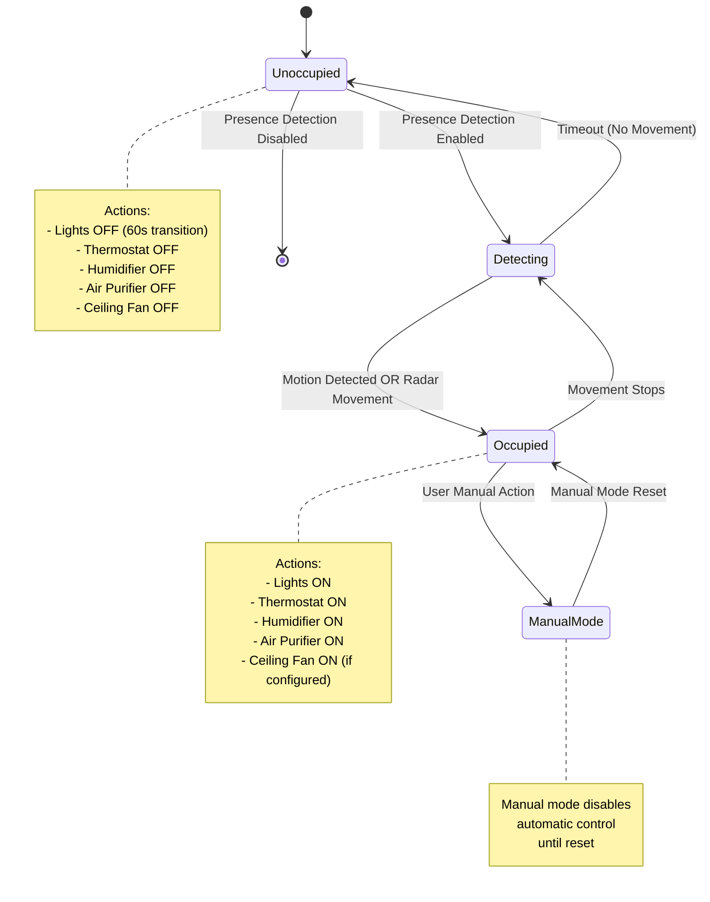
```mermaid
stateDiagram-v2
    [*] --> Unoccupied
    
    Unoccupied --> Detecting: Presence Detection Enabled
    Detecting --> Occupied: Motion Detected OR Radar Movement
    Occupied --> Detecting: Movement Stops
    Detecting --> Unoccupied: Timeout (No Movement)
    
    Occupied --> ManualMode: User Manual Action
    ManualMode --> Occupied: Manual Mode Reset
    
    Unoccupied --> [*]: Presence Detection Disabled
    
    note right of Occupied
        Actions:
        - Lights ON
        - Thermostat ON
        - Humidifier ON
        - Air Purifier ON
        - Ceiling Fan ON (if configured)
    end note
    
    note right of Unoccupied
        Actions:
        - Lights OFF (60s transition)
        - Thermostat OFF
        - Humidifier OFF
        - Air Purifier OFF
        - Ceiling Fan OFF
    end note
    
    note right of ManualMode
        Manual mode disables
        automatic control
        until reset
    end note
```

#### Radar Sensor Gate Logic

LD2410C radar sensors provide advanced presence detection by monitoring 9 distance zones (gates 0-8):

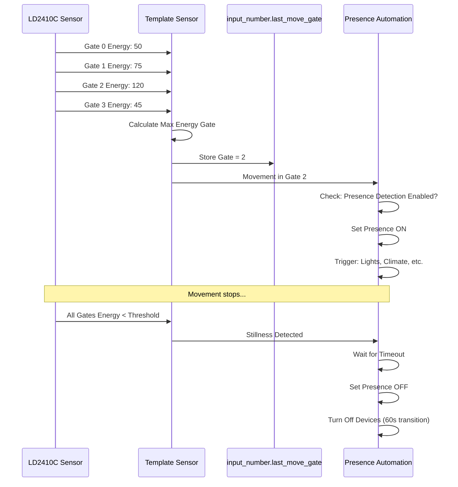
```mermaid
sequenceDiagram
    participant Radar as LD2410C Sensor
    participant Template as Template Sensor
    participant Helper as input_number.last_move_gate
    participant Automation as Presence Automation
    
    Radar->>Template: Gate 0 Energy: 50
    Radar->>Template: Gate 1 Energy: 75
    Radar->>Template: Gate 2 Energy: 120
    Radar->>Template: Gate 3 Energy: 45
    Template->>Template: Calculate Max Energy Gate
    Template->>Helper: Store Gate = 2
    Template->>Automation: Movement in Gate 2
    Automation->>Automation: Check: Presence Detection Enabled?
    Automation->>Automation: Set Presence ON
    Automation->>Automation: Trigger: Lights, Climate, etc.
    
    Note over Radar,Automation: Movement stops...
    
    Radar->>Template: All Gates Energy < Threshold
    Template->>Automation: Stillness Detected
    Automation->>Automation: Wait for Timeout
    Automation->>Automation: Set Presence OFF
    Automation->>Automation: Turn Off Devices (60s transition)
```

#### Implementation Per Area

Each area implements presence detection with area-specific configurations:

| Area | Sensors | Devices Controlled |
|------|---------|-------------------|
| **Bedroom** | LD2410C Radar, PIR Motion | Lights, Thermostat, Humidifier, Air Purifier, Ceiling Fan, Blinds |
| **Living Room** | LD2410C Radar, PIR Motion | Lights, Air Purifier, Humidifier, Thermostat (via common) |
| **Kitchen** | LD2410C Radar | Lights, Gate Control |
| **Bathroom** | Door Contact, PIR Motion | Lights, Exhaust Fan |
| **Hallway** | PIR Motion | Lights |
| **Storage Room** | PIR Motion | Lights |

**Configuration Example:**
```yaml
# Bedroom Presence Detection Enable/Disable
input_boolean.bedroom_presence_detection: 
  - ON: Automatic presence-based control active
  - OFF: Manual control only

# Gate Tracking
input_number.bedroom_ld2410c_last_move_gate:
  - Stores: Last gate (0-8) where movement detected
  - Used for: Advanced presence logic
```

---

### 2. Zone Transition System

Zone transitions handle behaviors when entering or leaving the home, providing seamless handoffs between away and home modes.

#### Zone Transition Flow

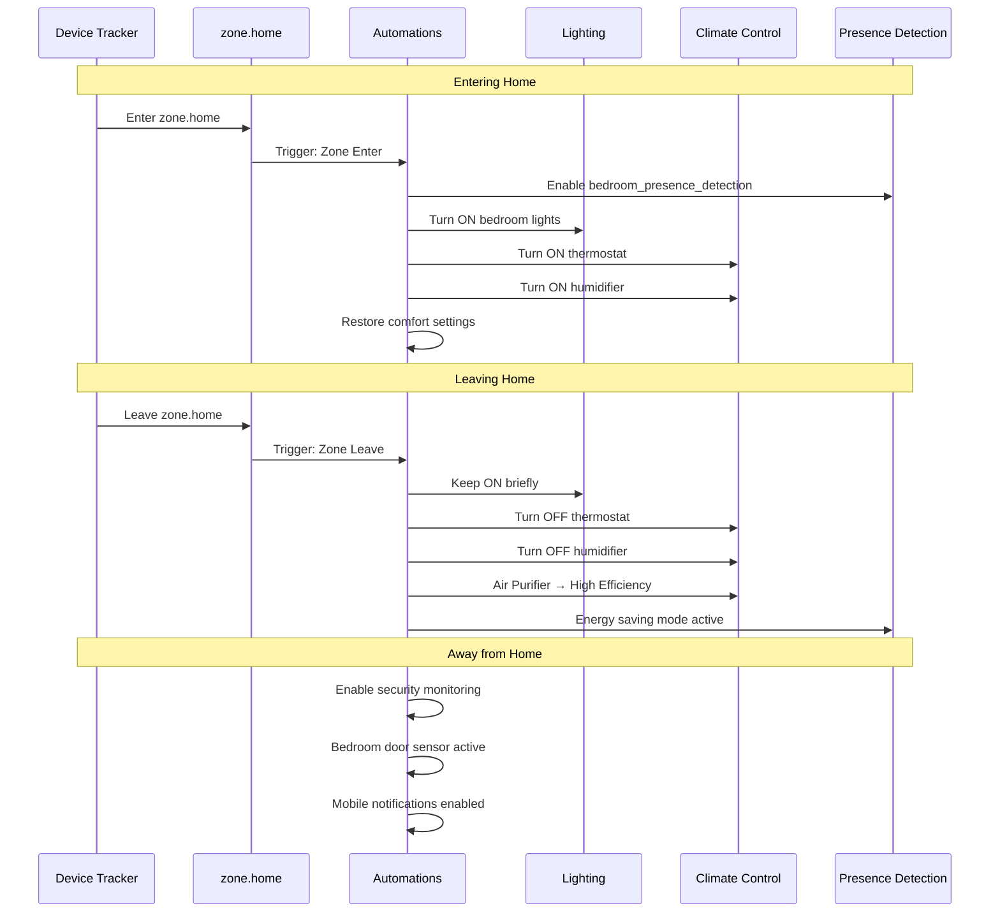
```mermaid
sequenceDiagram
    participant DT as Device Tracker
    participant Zone as zone.home
    participant Auto as Automations
    participant Lights as Lighting
    participant Climate as Climate Control
    participant Presence as Presence Detection
    
    Note over DT,Presence: Entering Home
    
    DT->>Zone: Enter zone.home
    Zone->>Auto: Trigger: Zone Enter
    Auto->>Presence: Enable bedroom_presence_detection
    Auto->>Lights: Turn ON bedroom lights
    Auto->>Climate: Turn ON thermostat
    Auto->>Climate: Turn ON humidifier
    Auto->>Auto: Restore comfort settings
    
    Note over DT,Presence: Leaving Home
    
    DT->>Zone: Leave zone.home
    Zone->>Auto: Trigger: Zone Leave
    Auto->>Lights: Keep ON briefly
    Auto->>Climate: Turn OFF thermostat
    Auto->>Climate: Turn OFF humidifier
    Auto->>Climate: Air Purifier → High Efficiency
    Auto->>Presence: Energy saving mode active
    
    Note over DT,Presence: Away from Home
    
    Auto->>Auto: Enable security monitoring
    Auto->>Auto: Bedroom door sensor active
    Auto->>Auto: Mobile notifications enabled
```

#### Zone States and Actions

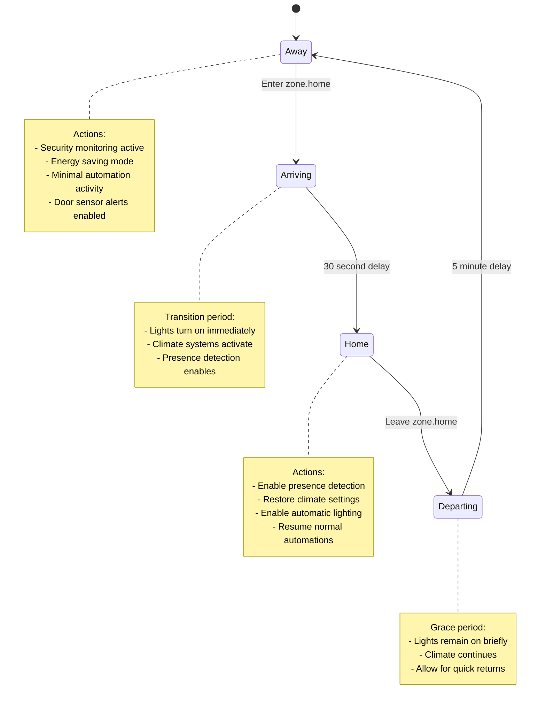
```mermaid
stateDiagram-v2
    [*] --> Away
    Away --> Arriving: Enter zone.home
    Arriving --> Home: 30 second delay
    Home --> Departing: Leave zone.home
    Departing --> Away: 5 minute delay
    
    note right of Home
        Actions:
        - Enable presence detection
        - Restore climate settings
        - Enable automatic lighting
        - Resume normal automations
    end note
    
    note right of Away
        Actions:
        - Security monitoring active
        - Energy saving mode
        - Minimal automation activity
        - Door sensor alerts enabled
    end note
    
    note right of Arriving
        Transition period:
        - Lights turn on immediately
        - Climate systems activate
        - Presence detection enables
    end note
    
    note right of Departing
        Grace period:
        - Lights remain on briefly
        - Climate continues
        - Allow for quick returns
    end note
```

#### Supported Zones

- **zone.home**: Primary residence (all automations active)
- **zone.tarrytown**: Secondary location (enter/leave tracking)
- **zone.ctown**: Tertiary location (enter tracking)

---

### 3. Time-Based Routines

Time-based automations create daily rhythms and optimize comfort throughout the day.

#### Daily Routine Timeline

```mermaid
gantt
    title Daily Automation Schedule
    dateFormat HH:mm
    axisFormat %H:%M
    
    section Morning
    Sunrise Simulation     :active, 06:00, 30m
    Blinds Open           :crit, 06:30, 15m
    Display: Sunrise View :06:30, 2h
    Brush Teeth Reminder  :milestone, 07:00, 0m
    Morning TV Cast       :07:30, 1h
    
    section Day
    Normal Operations     :08:30, 9h
    Vacuum Schedule       :crit, 12:00, 1h
    
    section Evening
    Sunset Triggers       :active, 17:30, 30m
    Blinds Close          :crit, 18:00, 15m
    Display: Sunset View  :18:00, 2h
    Evening Lighting      :19:00, 2h
    
    section Night
    Brush Teeth Reminder  :milestone, 21:00, 0m
    Sleep Mode Activate   :active, 21:30, 30m
    Adaptive Lighting Shift :22:00, 30m
    Bedtime Routine       :crit, 22:30, 30m
    Night Mode Active     :23:00, 7h
    
    section Maintenance
    System Updates        :milestone, 00:00, 0m
```

#### Morning Routine Details

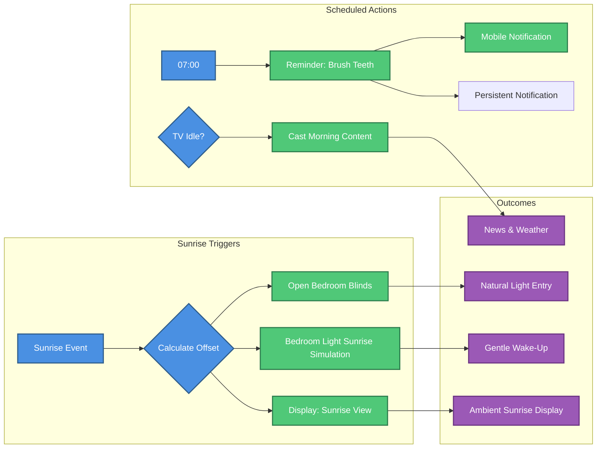
```mermaid
flowchart LR
    subgraph "Sunrise Triggers"
        SR[Sunrise Event]
        SR --> SunOffset{Calculate Offset}
        SunOffset --> BlindsOpen[Open Bedroom Blinds]
        SunOffset --> LightSim[Bedroom Light Sunrise Simulation]
        SunOffset --> DisplaySunrise[Display: Sunrise View]
    end
    
    subgraph "Scheduled Actions"
        Time0700[07:00] --> BrushTeeth[Reminder: Brush Teeth]
        BrushTeeth --> Notify1[Mobile Notification]
        BrushTeeth --> Notify2[Persistent Notification]
        
        TVIdle{TV Idle?} --> MorningCast[Cast Morning Content]
    end
    
    subgraph "Outcomes"
        BlindsOpen --> NaturalLight[Natural Light Entry]
        LightSim --> GentleWake[Gentle Wake-Up]
        DisplaySunrise --> AmbientView[Ambient Sunrise Display]
        MorningCast --> NewsWeather[News & Weather]
    end
    
    classDef triggerClass fill:#4A90E2,stroke:#2E5C8A,stroke-width:2px,color:#fff
    classDef actionClass fill:#50C878,stroke:#2E7D4E,stroke-width:2px,color:#fff
    classDef outcomeClass fill:#9B59B6,stroke:#6C3483,stroke-width:2px,color:#fff
    
    class SR,SunOffset,Time0700,TVIdle triggerClass
    class BlindsOpen,LightSim,DisplaySunrise,BrushTeeth,Notify1,MorningCast actionClass
    class NaturalLight,GentleWake,AmbientView,NewsWeather outcomeClass
```

#### Evening & Night Routine Details

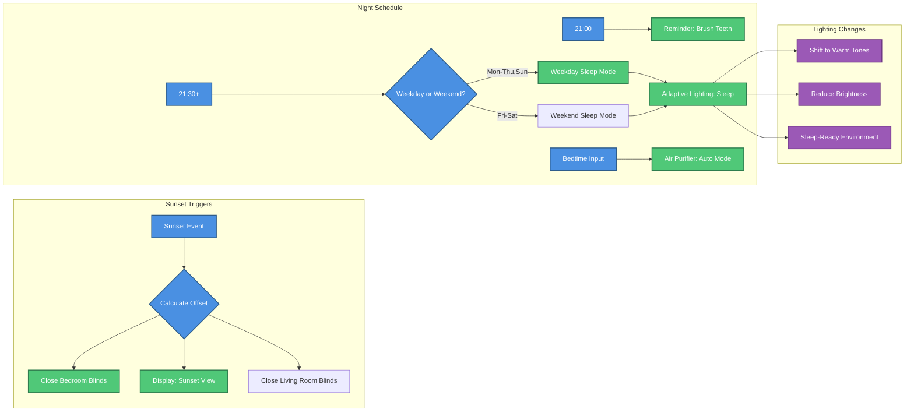
```mermaid
flowchart LR
    subgraph "Sunset Triggers"
        SS[Sunset Event]
        SS --> SunsetOffset{Calculate Offset}
        SunsetOffset --> BlindsClose[Close Bedroom Blinds]
        SunsetOffset --> DisplaySunset[Display: Sunset View]
        SunsetOffset --> LivingBlinds[Close Living Room Blinds]
    end
    
    subgraph "Night Schedule"
        Time2100[21:00] --> BrushTeethEvening[Reminder: Brush Teeth]
        Time2130[21:30+] --> SleepMode{Weekday or Weekend?}
        SleepMode -->|Mon-Thu,Sun| WeekdaySchedule[Weekday Sleep Mode]
        SleepMode -->|Fri-Sat| WeekendSchedule[Weekend Sleep Mode]
        
        WeekdaySchedule --> AdaptiveLighting[Adaptive Lighting: Sleep]
        WeekendSchedule --> AdaptiveLighting
        
        Bedtime[Bedtime Input] --> AirPurifierAuto[Air Purifier: Auto Mode]
    end
    
    subgraph "Lighting Changes"
        AdaptiveLighting --> WarmTones[Shift to Warm Tones]
        AdaptiveLighting --> LowBrightness[Reduce Brightness]
        AdaptiveLighting --> SleepReady[Sleep-Ready Environment]
    end
    
    classDef triggerClass fill:#4A90E2,stroke:#2E5C8A,stroke-width:2px,color:#fff
    classDef actionClass fill:#50C878,stroke:#2E7D4E,stroke-width:2px,color:#fff
    classDef outcomeClass fill:#9B59B6,stroke:#6C3483,stroke-width:2px,color:#fff
    
    class SS,SunsetOffset,Time2100,Time2130,SleepMode,Bedtime triggerClass
    class BlindsClose,DisplaySunset,BrushTeethEvening,WeekdaySchedule,AdaptiveLighting,AirPurifierAuto actionClass
    class WarmTones,LowBrightness,SleepReady outcomeClass
```

#### Time-Based Configuration

```yaml
# Configuration via Input DateTimes
input_datetime.morning: 07:00
input_datetime.evening: 18:00  
input_datetime.night: 21:00
input_datetime.bedroom_bedtime: 22:30
input_datetime.adaptive_lighting_sleep_mode_on_weekday: 21:30
input_datetime.adaptive_lighting_sleep_mode_on_weekend: 22:30
```

---

### 4. Manual Override System

The manual override system detects user-initiated device control and temporarily disables conflicting automations, ensuring the system respects user preferences.

#### Manual Override State Machine

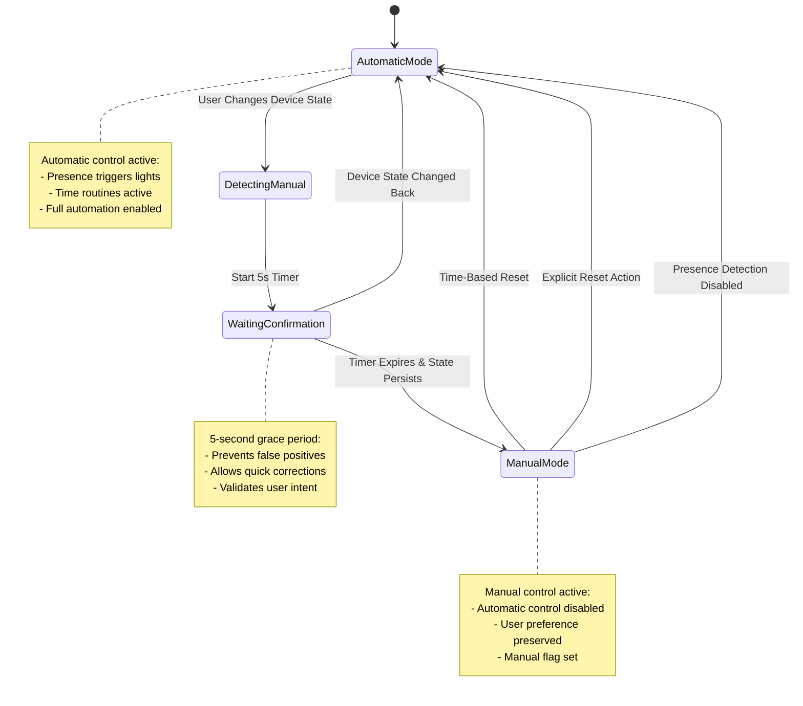
```mermaid
stateDiagram-v2
    [*] --> AutomaticMode
    
    AutomaticMode --> DetectingManual: User Changes Device State
    DetectingManual --> WaitingConfirmation: Start 5s Timer
    WaitingConfirmation --> AutomaticMode: Device State Changed Back
    WaitingConfirmation --> ManualMode: Timer Expires & State Persists
    
    ManualMode --> AutomaticMode: Time-Based Reset
    ManualMode --> AutomaticMode: Explicit Reset Action
    ManualMode --> AutomaticMode: Presence Detection Disabled
    
    note right of AutomaticMode
        Automatic control active:
        - Presence triggers lights
        - Time routines active
        - Full automation enabled
    end note
    
    note right of ManualMode
        Manual control active:
        - Automatic control disabled
        - User preference preserved
        - Manual flag set
    end note
    
    note right of WaitingConfirmation
        5-second grace period:
        - Prevents false positives
        - Allows quick corrections
        - Validates user intent
    end note
```

#### Manual Override Flow

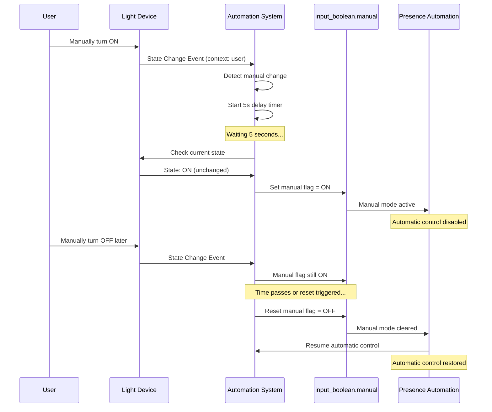
```mermaid
sequenceDiagram
    participant User
    participant Light as Light Device
    participant Auto as Automation System
    participant Helper as input_boolean.manual
    participant Presence as Presence Automation
    
    User->>Light: Manually turn ON
    Light->>Auto: State Change Event (context: user)
    Auto->>Auto: Detect manual change
    Auto->>Auto: Start 5s delay timer
    
    Note over Auto: Waiting 5 seconds...
    
    Auto->>Light: Check current state
    Light->>Auto: State: ON (unchanged)
    Auto->>Helper: Set manual flag = ON
    Helper->>Presence: Manual mode active
    
    Note over Presence: Automatic control disabled
    
    User->>Light: Manually turn OFF later
    Light->>Auto: State Change Event
    Auto->>Helper: Manual flag still ON
    
    Note over Auto,Helper: Time passes or reset triggered...
    
    Auto->>Helper: Reset manual flag = OFF
    Helper->>Presence: Manual mode cleared
    Presence->>Auto: Resume automatic control
    
    Note over Presence: Automatic control restored
```

#### Implementation Details

**Areas with Manual Override:**
- Bedroom
- Living Room
- Kitchen
- Bathroom
- Hallway
- Storage Room

**Detection Mechanism:**
```yaml
trigger:
  - platform: state
    entity_id: light.bedroom_light
    context:
      user_id: !secret user_id  # Only user changes, not automations

action:
  - delay: 5  # Grace period
  - condition: state
    entity_id: light.bedroom_light
    state: "{{ trigger.to_state.state }}"  # State unchanged
  - service: input_boolean.turn_on
    target:
      entity_id: input_boolean.bedroom_light_manual
```

**Reset Conditions:**
- Time-based (e.g., daily reset at midnight)
- Zone transitions (leaving/entering home)
- Explicit reset automation
- Presence detection disabled

---

## Device-Specific Automations

### 3D Printer (Bambu Lab) - Storage Room

The 3D printer automation handles print completion with a multi-step sequence:

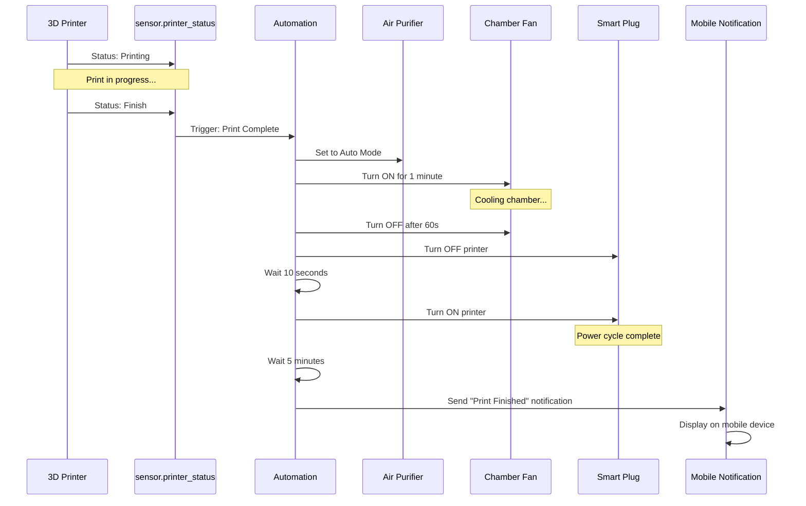
```mermaid
sequenceDiagram
    participant Printer as 3D Printer
    participant Sensor as sensor.printer_status
    participant Auto as Automation
    participant AirPurifier as Air Purifier
    participant Fan as Chamber Fan
    participant Power as Smart Plug
    participant Notify as Mobile Notification
    
    Printer->>Sensor: Status: Printing
    Note over Printer,Sensor: Print in progress...
    
    Printer->>Sensor: Status: Finish
    Sensor->>Auto: Trigger: Print Complete
    
    Auto->>AirPurifier: Set to Auto Mode
    Auto->>Fan: Turn ON for 1 minute
    
    Note over Fan: Cooling chamber...
    
    Auto->>Fan: Turn OFF after 60s
    Auto->>Power: Turn OFF printer
    Auto->>Auto: Wait 10 seconds
    Auto->>Power: Turn ON printer
    
    Note over Power: Power cycle complete
    
    Auto->>Auto: Wait 5 minutes
    Auto->>Notify: Send "Print Finished" notification
    Notify->>Notify: Display on mobile device
```

**Key Features:**
- Chamber cooling with fan cycle
- Automatic power cycle to reset printer
- Delayed notification (avoids spam)
- Air quality management
- Night mode behavior adjustments

---

### Vacuum Cleaner (Living Room)

The vacuum automation includes scheduling, status monitoring, and display integration:

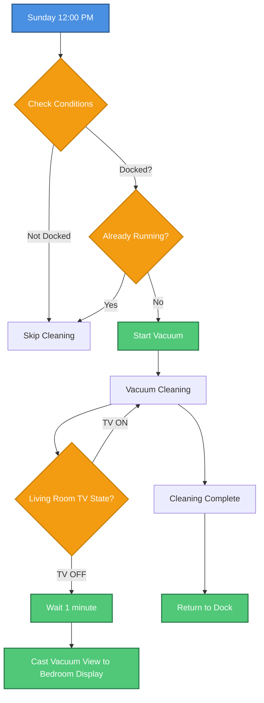
```mermaid
flowchart TD
    Schedule[Sunday 12:00 PM] --> CheckConditions{Check Conditions}
    CheckConditions -->|Docked?| CheckRunning{Already Running?}
    CheckConditions -->|Not Docked| Skip[Skip Cleaning]
    CheckRunning -->|No| StartVacuum[Start Vacuum]
    CheckRunning -->|Yes| Skip
    
    StartVacuum --> Cleaning[Vacuum Cleaning]
    
    Cleaning --> TVCheck{Living Room TV State?}
    TVCheck -->|TV OFF| WaitOne[Wait 1 minute]
    TVCheck -->|TV ON| Cleaning
    
    WaitOne --> CastView[Cast Vacuum View to Bedroom Display]
    
    Cleaning --> Complete[Cleaning Complete]
    Complete --> ReturnDock[Return to Dock]
    
    classDef triggerClass fill:#4A90E2,stroke:#2E5C8A,stroke-width:2px,color:#fff
    classDef actionClass fill:#50C878,stroke:#2E7D4E,stroke-width:2px,color:#fff
    classDef conditionClass fill:#F39C12,stroke:#C87F0A,stroke-width:2px,color:#fff
    
    class Schedule triggerClass
    class StartVacuum,WaitOne,CastView,ReturnDock actionClass
    class CheckConditions,CheckRunning,TVCheck conditionClass
```

**Configuration:**
- **Schedule**: Sunday 12:00 PM
- **Conditions**: Must be docked, not already running
- **Display Integration**: Shows vacuum status on bedroom display when living room TV is off

---

### Coffee Pot (Kitchen)

Simple timer-based safety automation:

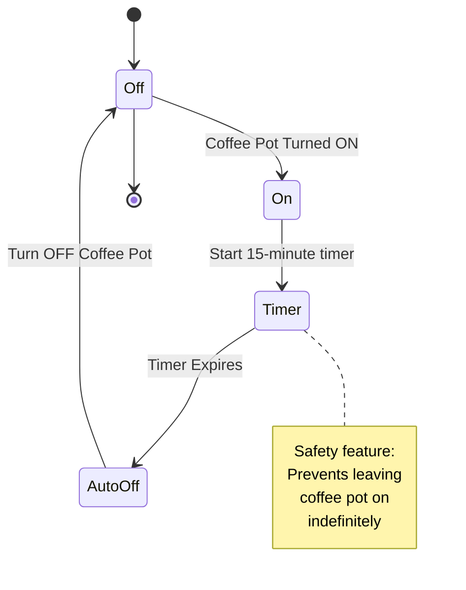
```mermaid
stateDiagram-v2
    [*] --> Off
    Off --> On: Coffee Pot Turned ON
    On --> Timer: Start 15-minute timer
    Timer --> AutoOff: Timer Expires
    AutoOff --> Off: Turn OFF Coffee Pot
    Off --> [*]
    
    note right of Timer
        Safety feature:
        Prevents leaving
        coffee pot on
        indefinitely
    end note
```

---

### Blinds & Covers

Automated blind control across bedroom, living room, and kitchen:


```mermaid
flowchart TD
    subgraph "Automatic Control"
        Sunrise[Sunrise] --> OpenBlinds[Open All Blinds]
        Sunset[Sunset] --> CloseBlinds[Close All Blinds]
        Bedtime[Bedtime] --> NightPosition[Night Position]
    end
    
    subgraph "Manual Detection"
        UserAction[User Opens/Closes Blind] --> DetectManual[Detect Manual Operation]
        DetectManual --> SetManualFlag[Set Manual Mode Flag]
        SetManualFlag --> DisableAuto[Disable Automatic Control]
    end
    
    subgraph "Calibration"
        CalibrationTrigger[Calibration Needed] --> CloseCompletely[Close to 0%]
        CloseCompletely --> OpenCompletely[Open to 100%]
        OpenCompletely --> MidPosition[Set to 50%]
        MidPosition --> CalibrationComplete[Calibration Complete]
    end
    
    subgraph "Coordination"
        MultiBlind[Multiple Blinds per Area] --> Sync[Synchronized Movement]
        Sync --> GroupOne[Blind One]
        Sync --> GroupTwo[Blind Two]
        Sync --> GroupThree[Blind Three]
    end
    
    classDef triggerClass fill:#4A90E2,stroke:#2E5C8A,stroke-width:2px,color:#fff
    classDef actionClass fill:#50C878,stroke:#2E7D4E,stroke-width:2px,color:#fff
    
    class Sunrise,Sunset,Bedtime,UserAction,CalibrationTrigger triggerClass
    class OpenBlinds,CloseBlinds,NightPosition,SetManualFlag,DisableAuto,CloseCompletely,MidPosition,Sync actionClass
```

**Features:**
- Sunrise/sunset automation
- Manual mode detection
- Calibration routines
- Multi-blind coordination (bedroom has 3 blinds, living room has 3, kitchen has 1)

---

### TV Automations

Smart TV integration with state-based triggers:

- **TV ON**: Enable presence-aware behaviors
- **TV OFF**: Trigger vacuum display cast (if cleaning)
- **TV Idle**: Cast morning content or default views
- **Integration**: Works with presence detection and time routines

---

## Environmental Monitoring and Safety

### Air Quality Monitoring

The system monitors multiple air quality parameters and sends alerts when thresholds are exceeded:

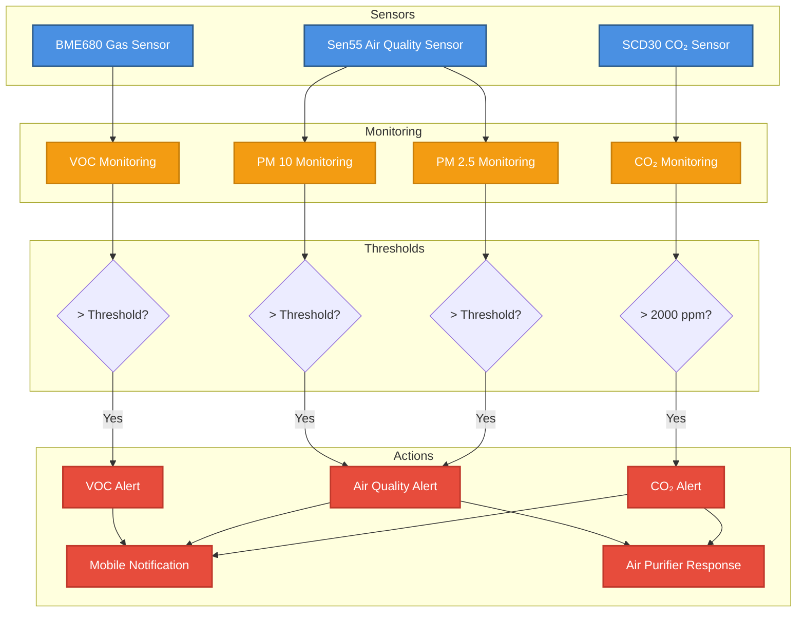
```mermaid
flowchart TD
    subgraph "Sensors"
        SCD30[SCD30 CO₂ Sensor]
        Sen55[Sen55 Air Quality Sensor]
        BME680[BME680 Gas Sensor]
    end
    
    subgraph "Monitoring"
        SCD30 --> CO2Monitor[CO₂ Monitoring]
        Sen55 --> PM25Monitor[PM 2.5 Monitoring]
        Sen55 --> PM10Monitor[PM 10 Monitoring]
        BME680 --> VOCMonitor[VOC Monitoring]
    end
    
    subgraph "Thresholds"
        CO2Monitor --> CO2Threshold{> 2000 ppm?}
        PM25Monitor --> PM25Threshold{> Threshold?}
        PM10Monitor --> PM10Threshold{> Threshold?}
        VOCMonitor --> VOCThreshold{> Threshold?}
    end
    
    subgraph "Actions"
        CO2Threshold -->|Yes| CO2Alert[CO₂ Alert]
        PM25Threshold -->|Yes| AQAlert[Air Quality Alert]
        PM10Threshold -->|Yes| AQAlert
        VOCThreshold -->|Yes| VOCAlert[VOC Alert]
        
        CO2Alert --> MobileNotify[Mobile Notification]
        AQAlert --> MobileNotify
        VOCAlert --> MobileNotify
        
        CO2Alert --> AutoResponse[Air Purifier Response]
        AQAlert --> AutoResponse
    end
    
    classDef sensorClass fill:#4A90E2,stroke:#2E5C8A,stroke-width:2px,color:#fff
    classDef monitorClass fill:#F39C12,stroke:#C87F0A,stroke-width:2px,color:#fff
    classDef alertClass fill:#E74C3C,stroke:#C0392B,stroke-width:2px,color:#fff
    
    class SCD30,Sen55,BME680 sensorClass
    class CO2Monitor,PM25Monitor,PM10Monitor,VOCMonitor monitorClass
    class CO2Alert,AQAlert,VOCAlert,MobileNotify,AutoResponse alertClass
```

**Monitored Parameters:**

| Parameter | Sensor | Threshold | Action |
|-----------|--------|-----------|--------|
| **CO₂** | SCD30 | 2000 ppm | Mobile alert + air purifier activation |
| **PM 2.5** | Sen55 | Configurable | Mobile alert + air purifier auto mode |
| **PM 10** | Sen55 | Configurable | Mobile alert + air purifier response |
| **VOC** | BME680 | Configurable | Mobile alert |
| **Temperature** | Multiple | N/A | Climate control input |
| **Humidity** | Multiple | N/A | Humidifier control input |

**Configuration:**
```yaml
input_number.bedroom_carbon_dioxide_maximum: 2000  # ppm
input_number.bedroom_pm25_threshold: 35  # μg/m³
input_number.bedroom_pm10_threshold: 50  # μg/m³
```

---

### Water Leak Detection

Storage room water leak monitoring with immediate notification:

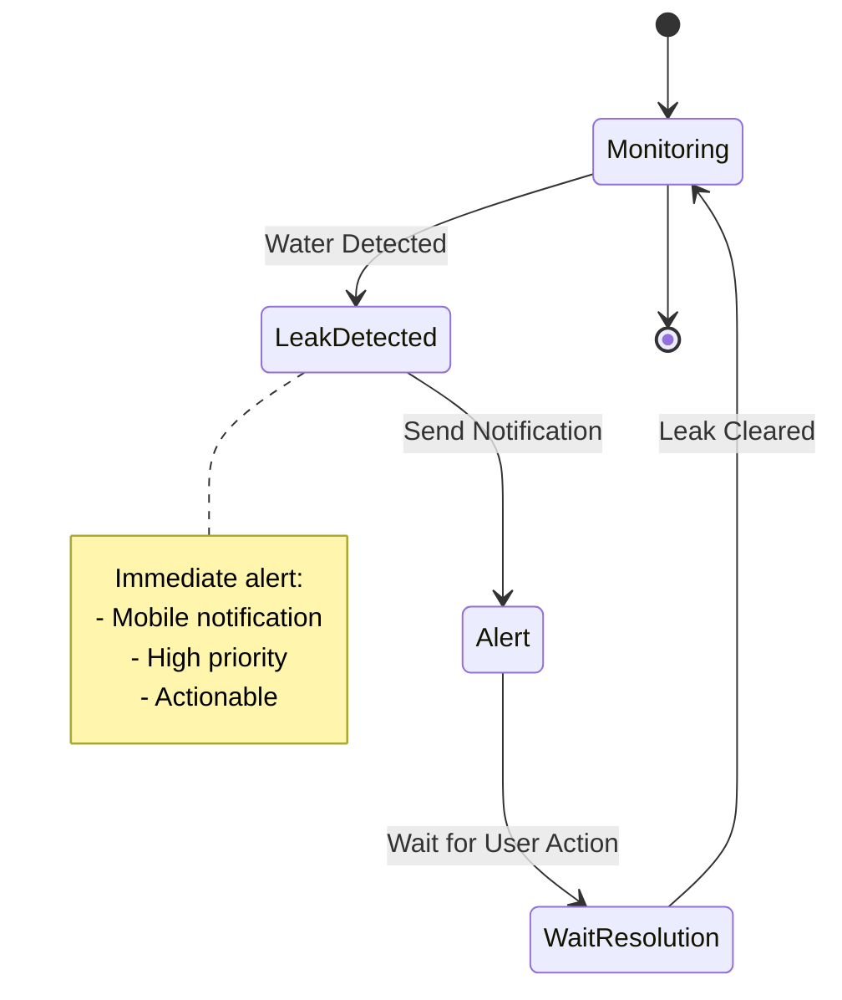
```mermaid
stateDiagram-v2
    [*] --> Monitoring
    Monitoring --> LeakDetected: Water Detected
    LeakDetected --> Alert: Send Notification
    Alert --> WaitResolution: Wait for User Action
    WaitResolution --> Monitoring: Leak Cleared
    Monitoring --> [*]
    
    note right of LeakDetected
        Immediate alert:
        - Mobile notification
        - High priority
        - Actionable
    end note
```

---

### Security Monitoring (Away Mode)

When away from home, security monitoring activates:

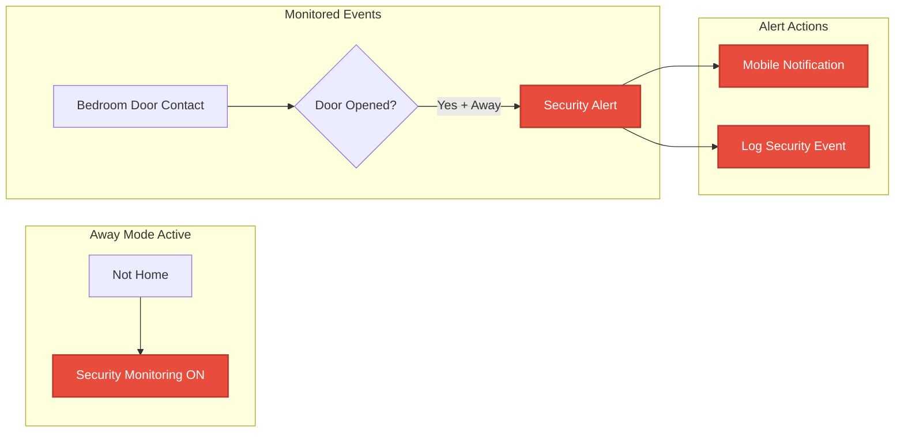
```mermaid
flowchart LR
    subgraph "Away Mode Active"
        AwayState[Not Home] --> SecurityOn[Security Monitoring ON]
    end
    
    subgraph "Monitored Events"
        DoorSensor[Bedroom Door Contact] --> DoorOpen{Door Opened?}
        DoorOpen -->|Yes + Away| SecurityAlert[Security Alert]
    end
    
    subgraph "Alert Actions"
        SecurityAlert --> MobileNotify[Mobile Notification]
        SecurityAlert --> LogEvent[Log Security Event]
    end
    
    classDef securityClass fill:#E74C3C,stroke:#C0392B,stroke-width:2px,color:#fff
    class SecurityOn,SecurityAlert,MobileNotify,LogEvent securityClass
```

---

## System Integration and Dependencies

### Helper Entity Architecture

The system relies heavily on helper entities for state management and configuration:


```mermaid
graph TB
    subgraph "Input Booleans - Flags & Toggles"
        PD[presence_detection_*]
        Manual[*_manual]
        Reminders[reminder_toggles]
        Common[common_presence_detection]
    end
    
    subgraph "Input Numbers - Thresholds & Values"
        Gates[*_last_move_gate]
        Thresholds[*_threshold_*]
        Timings[*_transition_*]
        Defaults[*_default_*]
    end
    
    subgraph "Input DateTimes - Schedules"
        Daily[morning/evening/night]
        Sleep[adaptive_lighting_sleep_*]
        Bedtime[*_bedtime]
    end
    
    subgraph "Input Selects - Modes"
        ClimateZone[climate_zone]
        Modes[device_modes]
    end
    
    subgraph "Automations"
        AreaAuto[Area Automations]
        DomainAuto[Domain Automations]
        CommonAuto[Common Automations]
    end
    
    PD --> AreaAuto
    Manual --> AreaAuto
    Gates --> AreaAuto
    Thresholds --> AreaAuto
    Timings --> AreaAuto
    Daily --> DomainAuto
    Sleep --> DomainAuto
    ClimateZone --> CommonAuto
    Reminders --> DomainAuto
    Common --> CommonAuto
    
    classDef booleanClass fill:#3498DB,stroke:#2874A6,stroke-width:2px,color:#fff
    classDef numberClass fill:#E67E22,stroke:#CA6F1E,stroke-width:2px,color:#fff
    classDef dateClass fill:#9B59B6,stroke:#6C3483,stroke-width:2px,color:#fff
    classDef selectClass fill:#1ABC9C,stroke:#17A589,stroke-width:2px,color:#fff
    classDef autoClass fill:#95A5A6,stroke:#7F8C8D,stroke-width:2px,color:#fff
    
    class PD,Manual,Reminders,Common booleanClass
    class Gates,Thresholds,Timings,Defaults numberClass
    class Daily,Sleep,Bedtime dateClass
    class ClimateZone,Modes selectClass
    class AreaAuto,DomainAuto,CommonAuto autoClass
```

### Integration Dependencies

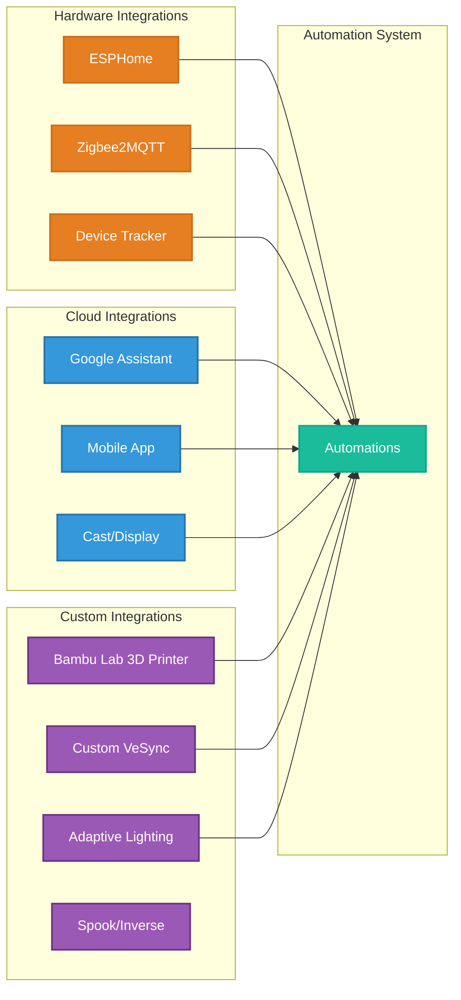
```mermaid
flowchart LR
    subgraph "Hardware Integrations"
        ESPHome[ESPHome]
        Zigbee[Zigbee2MQTT]
        DeviceTracker[Device Tracker]
    end
    
    subgraph "Cloud Integrations"
        Google[Google Assistant]
        MobileApp[Mobile App]
        Cast[Cast/Display]
    end
    
    subgraph "Custom Integrations"
        BambuLab[Bambu Lab 3D Printer]
        VeSync[Custom VeSync]
        AdaptiveLighting[Adaptive Lighting]
        Spook[Spook/Inverse]
    end
    
    subgraph "Automation System"
        Automations[Automations]
    end
    
    ESPHome --> Automations
    Zigbee --> Automations
    DeviceTracker --> Automations
    Google --> Automations
    MobileApp --> Automations
    Cast --> Automations
    BambuLab --> Automations
    VeSync --> Automations
    AdaptiveLighting --> Automations
    
    classDef hwClass fill:#E67E22,stroke:#CA6F1E,stroke-width:2px,color:#fff
    classDef cloudClass fill:#3498DB,stroke:#2874A6,stroke-width:2px,color:#fff
    classDef customClass fill:#9B59B6,stroke:#6C3483,stroke-width:2px,color:#fff
    classDef coreClass fill:#1ABC9C,stroke:#17A589,stroke-width:2px,color:#fff
    
    class ESPHome,Zigbee,DeviceTracker hwClass
    class Google,MobileApp,Cast cloudClass
    class BambuLab,VeSync,AdaptiveLighting,Spook customClass
    class Automations coreClass
```

### Cross-Package Entity References

**Shared Presence Entities:**
```yaml
# Used across multiple area automations
binary_sensor.common_presence  # Kitchen + Hallway aggregation
binary_sensor.occupancy_all    # All areas combined
binary_sensor.bedroom_presence_presence
binary_sensor.living_room_presence_presence
binary_sensor.kitchen_presence_presence
```

**Gate Tracking Entities (Per Area):**
```yaml
input_number.bedroom_ld2410c_last_move_gate
input_number.living_room_ld2410c_last_move_gate
input_number.kitchen_ld2410c_last_move_gate
```

**Climate Zone Management:**
```yaml
input_select.bedroom_climate_zone  # Values: Home, Away, Sleep
input_number.bedroom_thermostat_default  # Default temperature
```

**Manual Mode Flags (Per Area):**
```yaml
input_boolean.bedroom_light_manual
input_boolean.living_room_light_manual
input_boolean.kitchen_light_manual
input_boolean.bathroom_light_manual
input_boolean.hallway_light_manual
input_boolean.storage_room_light_manual
```

---

## Statistics and Metrics

### Automation Distribution

```mermaid
pie title Automation Files by Category
    "Presence-Based (40%)" : 60
    "Time-Based (17%)" : 25
    "Device-Specific (14%)" : 20
    "Motion/Contact (10%)" : 15
    "Manual Override (7%)" : 10
    "Environmental (5%)" : 8
    "System Maintenance (3%)" : 5
    "Reminders (2%)" : 3
```

### Area Distribution

```mermaid
bar title Automation Files per Area
    x-axis [Bedroom, Living Room, Kitchen, Bathroom, Hallway, Storage, Apartment]
    y-axis "Number of Automations" 0 --> 40
    bar [35, 30, 20, 12, 10, 8, 5]
```

### Automation Statistics Summary

- **Total Automation Files**: 146+
- **Total Unique Automations**: 200+ (some files contain multiple automations)
- **Average Automations per Area**: ~16
- **Helper Entities**: 50+ input_boolean, 30+ input_number, 10+ input_datetime
- **Monitored Sensors**: 80+ sensors (presence, environmental, contact, etc.)
- **Controlled Devices**: 60+ devices (lights, climate, covers, appliances)

### System Performance Metrics

| Metric | Value | Notes |
|--------|-------|-------|
| **Average Automation Response Time** | < 1 second | Presence to light on |
| **Radar Detection Latency** | ~100ms | LD2410C sensor response |
| **PIR Detection Latency** | ~200ms | Traditional motion sensors |
| **Manual Mode Detection** | 5 seconds | Grace period |
| **Notification Delivery** | < 3 seconds | Mobile app |
| **Climate Response Time** | ~30 seconds | Thermostat adjustment |
| **Blind Operation Time** | 15-30 seconds | Full open/close |

---

## Automation Design Patterns

### Pattern 1: Sensor Fusion

**Use Case**: Combining multiple sensor types for reliable presence detection

**Implementation**:
```mermaid
flowchart LR
    Radar[LD2410C Radar] --> Fusion[Sensor Fusion Logic]
    PIR[PIR Motion] --> Fusion
    Contact[Door Contact] --> Fusion
    Time[Time of Day] --> Fusion
    Fusion --> Decision{Presence State}
    Decision -->|High Confidence| Occupied[Occupied]
    Decision -->|Low Confidence| Detecting[Detecting]
    Decision -->|No Signal| Unoccupied[Unoccupied]
```

**Benefits**:
- Reduces false positives/negatives
- More accurate presence detection
- Graceful degradation if sensor fails

---

### Pattern 2: State Machine with Timeouts

**Use Case**: Presence detection with delayed off transitions

**Implementation**:
```yaml
trigger:
  - platform: state
    entity_id: binary_sensor.bedroom_radar_presence
    to: "off"
    for:
      minutes: 5  # Timeout prevents flickering

action:
  - service: light.turn_off
    entity_id: light.bedroom_light
    data:
      transition: 60  # Gentle fade-out
```

**Benefits**:
- Prevents flickering lights
- Smooth transitions
- User-friendly behavior

---

### Pattern 3: Manual Override with Grace Period

**Use Case**: Detect user intent vs. automation oscillation

**Implementation**:
```yaml
trigger:
  - platform: state
    entity_id: light.bedroom_light
    context:
      user_id: !secret user_id

action:
  - delay: 5  # Grace period
  - condition: state
    entity_id: light.bedroom_light
    state: "{{ trigger.to_state.state }}"
  - service: input_boolean.turn_on
    entity_id: input_boolean.bedroom_light_manual
```

**Benefits**:
- Distinguishes user action from automation
- Prevents false manual mode activations
- Validates user intent

---

### Pattern 4: Conditional Branching by Time

**Use Case**: Different behaviors based on time of day

**Implementation**:
```yaml
action:
  - choose:
      - conditions:
          - condition: time
            after: "06:00:00"
            before: "22:00:00"
        sequence:
          - service: light.turn_on
            data:
              brightness: 255
      - conditions:
          - condition: time
            after: "22:00:00"
            before: "06:00:00"
        sequence:
          - service: light.turn_on
            data:
              brightness: 50
```

**Benefits**:
- Context-aware behaviors
- Respects circadian rhythms
- Reduces nighttime disturbance

---

### Pattern 5: Cascading Automation with Dependencies

**Use Case**: Multi-step sequences with checkpoints

**Implementation**:
```mermaid
sequenceDiagram
    participant A as Automation 1
    participant H as Helper Flag
    participant B as Automation 2
    participant C as Automation 3
    
    A->>A: Execute Step 1
    A->>H: Set checkpoint_1 = true
    H->>B: Trigger Automation 2
    B->>B: Check checkpoint_1
    B->>B: Execute Step 2
    B->>H: Set checkpoint_2 = true
    H->>C: Trigger Automation 3
    C->>C: Check checkpoint_1 & 2
    C->>C: Execute Step 3
```

**Benefits**:
- Complex workflows broken into manageable steps
- Fault isolation
- Easier debugging

---

### Pattern 6: Template-Based Dynamic Configuration

**Use Case**: Configurable thresholds and timings without editing YAML

**Implementation**:
```yaml
condition:
  - condition: template
    value_template: >
      {{ states('sensor.bedroom_co2') | float > 
         states('input_number.bedroom_carbon_dioxide_maximum') | float }}
```

**Benefits**:
- Runtime configuration changes
- No automation reloads
- User-friendly adjustments

---

## Reference

### Key Files and Locations

```
/packages/
├── areas/                          # Area-specific automations
│   ├── bedroom/                    # 35+ automations
│   ├── living_room/               # 30+ automations
│   ├── kitchen/                   # 20+ automations
│   ├── bathroom/                  # 12+ automations
│   ├── hallway/                   # 10+ automations
│   ├── storage_room/              # 8+ automations
│   └── apartment/                 # 5+ automations
├── domains/                       # Cross-cutting concerns
│   ├── zones/                     # Zone transition automations
│   ├── adaptive_lighting/         # Lighting schedules
│   ├── vacuum/                    # Vacuum automations
│   └── updates/                   # System maintenance
├── common/                        # Shared logic
│   ├── presence.yaml              # Common presence detection
│   └── climate.yaml               # Shared climate control
├── reminders/                     # Personal reminders
│   ├── brush_teeth/
│   ├── water_plants/
│   └── my_tasks/
└── schedules/                     # Time-based schedules
    ├── morning.yaml
    ├── evening.yaml
    └── night.yaml
```

### Naming Conventions

**Automation IDs:**
```yaml
# Pattern: {area}_{system}_{action}_{condition}
bedroom_presence_light_on            # Area: bedroom, System: presence, Action: light on
living_room_gate_update_last_move    # Area: living room, System: gate, Action: update
kitchen_light_manual_detect          # Area: kitchen, System: light, Action: manual detect
```

**Helper Entities:**
```yaml
# Input Booleans: {area}_{function}_{type}
input_boolean.bedroom_presence_detection
input_boolean.living_room_light_manual

# Input Numbers: {area}_{device}_{parameter}
input_number.bedroom_ld2410c_last_move_gate
input_number.bedroom_carbon_dioxide_maximum

# Input DateTimes: {context}_{time_of_day}
input_datetime.morning
input_datetime.bedroom_bedtime
```

### Common Entity IDs

**Binary Sensors (Presence):**
```yaml
binary_sensor.bedroom_presence_presence
binary_sensor.living_room_presence_presence
binary_sensor.kitchen_presence_presence
binary_sensor.common_presence
binary_sensor.occupancy_all
```

**Lights:**
```yaml
light.bedroom_light
light.living_room_light
light.kitchen_light
light.bathroom_light
light.hallway_light
```

**Climate:**
```yaml
climate.bedroom_thermostat
switch.bedroom_humidifier
fan.bedroom_air_purifier
fan.bedroom_ceiling_fan
```

**Covers:**
```yaml
cover.bedroom_blind_one
cover.bedroom_blind_two
cover.bedroom_blind_three
cover.living_room_blind_one
cover.kitchen_blind_one
```

### Notification Services

**Mobile Notifications:**
```yaml
service: notify.mobile_app_pixel_4_xl
data:
  title: "Alert Title"
  message: "Alert message"
  data:
    priority: high
    ttl: 0
    actions:
      - action: "MARK_COMPLETE"
        title: "Mark as Complete"
```

**Persistent Notifications:**
```yaml
service: persistent_notification.create
data:
  title: "Notification Title"
  message: "Notification message"
  notification_id: unique_id
```

### Configuration Examples

**Enable Presence Detection:**
```yaml
service: input_boolean.turn_on
entity_id: input_boolean.bedroom_presence_detection
```

**Set Manual Mode:**
```yaml
service: input_boolean.turn_on
entity_id: input_boolean.bedroom_light_manual
```

**Update Gate Tracking:**
```yaml
service: input_number.set_value
entity_id: input_number.bedroom_ld2410c_last_move_gate
data:
  value: 3  # Gate 3
```

**Set Climate Zone:**
```yaml
service: input_select.select_option
entity_id: input_select.bedroom_climate_zone
data:
  option: "Home"  # or "Away" or "Sleep"
```

---

## Conclusion

This automation system represents a **mature, production-ready smart home implementation** that balances automation convenience with user control. Key achievements include:

### Strengths

1. **Comprehensive Coverage**: 146+ automations covering all aspects of daily life
2. **Intelligent Presence Detection**: Multi-sensor fusion with radar and PIR sensors
3. **User Respect**: Sophisticated manual override system prevents automation conflicts
4. **Maintainability**: Hierarchical package structure with clear separation of concerns
5. **Reliability**: Fail-safes, timeouts, and graceful degradation
6. **Safety**: Environmental monitoring with proactive alerts
7. **Flexibility**: Runtime configuration via helper entities

### Design Philosophy

The system embodies several core principles:

- **Progressive Enhancement**: Basic functionality works with simple sensors; advanced features activate with better hardware
- **Graceful Degradation**: If a sensor fails, automations fall back to alternative triggers
- **User Sovereignty**: Manual control always takes precedence over automation
- **Explicit State Management**: Helper entities make system state visible and debuggable
- **Separation of Concerns**: Clear boundaries between areas, domains, and functions

### Future Enhancements

Potential areas for expansion:

1. **Machine Learning**: Adaptive schedules based on usage patterns
2. **Energy Monitoring**: Smart energy management and optimization
3. **Advanced Security**: Camera integration and AI-based threat detection
4. **Voice Control**: Enhanced Google Assistant/Alexa integration
5. **Guest Mode**: Temporary automation adjustments for visitors
6. **Seasonal Modes**: Weather-aware automation behaviors

### Maintenance Notes

- **Regular Review**: Audit automations quarterly for obsolete or redundant rules
- **Backup Strategy**: System updates include automatic backup creation
- **Testing**: Use `test.yaml` package for experimental automations
- **Logging**: Comprehensive logging via `logger.yaml` for troubleshooting
- **Documentation**: Keep this document synchronized with automation changes

---

**Document Version**: 2.0  
**Last Updated**: 2025-11-07  
**Total Automations**: 146+  
**System Status**: Production  
**Home Assistant Version**: 2025.11.x

---

*This documentation provides a comprehensive overview of the automation system. For specific automation details, refer to the individual YAML files in `/packages/`.*
