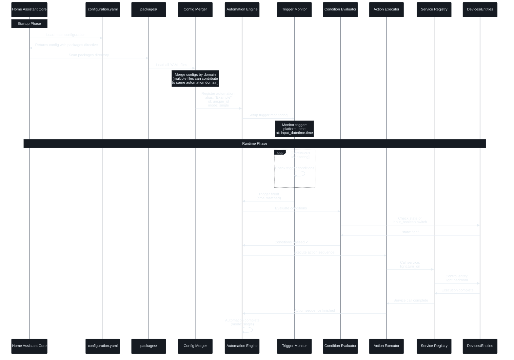

# Home Assistant Packages Automation Documentation

## Overview

This document provides comprehensive documentation for the Home Assistant packages automation system. The packages directory structure provides a modular, organized approach to managing automations, configurations, and entities across the entire Home Assistant installation.

## Table of Contents

1. [Architecture](#architecture)
2. [Package Organization](#package-organization)
3. [Naming Conventions](#naming-conventions)
4. [Automation Lifecycle](#automation-lifecycle)
5. [Trigger Types and Flow](#trigger-types-and-flow)
6. [Best Practices](#best-practices)
7. [Examples](#examples)
8. [Troubleshooting](#troubleshooting)

---

## Architecture

The Home Assistant packages system uses a hierarchical structure where `configuration.yaml` loads all package files, which are then merged by domain name to create a cohesive configuration.

### System Architecture Diagram

```mermaid
%%{init: {"theme": "base", "themeVariables": {"primaryColor": "#161b22", "primaryTextColor": "#e6edf3", "primaryBorderColor": "#30363d", "lineColor": "#7d8590", "secondaryColor": "#0d1117", "tertiaryColor": "#010409", "background": "#0d1117", "mainBkg": "#161b22", "secondBkg": "#0d1117", "tertiaryBkg": "#010409", "textColor": "#e6edf3", "border1": "#30363d", "border2": "#21262d", "arrowheadColor": "#7d8590", "fontFamily": "ui-monospace, SFMono-Regular, SF Mono, Menlo, Consolas, Liberation Mono, monospace", "fontSize": "14px", "nodeBorder": "#30363d", "clusterBkg": "#161b22", "clusterBorder": "#30363d", "defaultLinkColor": "#7d8590", "titleColor": "#e6edf3", "edgeLabelBackground": "#161b22", "nodeTextColor": "#e6edf3"}}}%%
flowchart TB
    config[configuration.yaml]
    packages[packages/]
    
    config -->|"!include_dir_merge_named"| packages
    
    packages --> toplevel[Top-Level Packages]
    packages --> areas[areas/]
    packages --> domains[domains/]
    packages --> common[common/]
    packages --> reminders[reminders/]
    packages --> schedules[schedules/]
    
    toplevel --> morning[morning.yaml]
    toplevel --> evening[evening.yaml]
    toplevel --> night[night.yaml]
    toplevel --> climate[climate.yaml]
    toplevel --> occupancy[occupancy.yaml]
    toplevel --> vacuum[vacuum.yaml]
    toplevel --> recorder[recorder.yaml]
    toplevel --> logger[logger.yaml]
    toplevel --> others["+10 more files"]
    
    areas --> bedroom[bedroom/]
    areas --> living_room[living_room/]
    areas --> kitchen[kitchen/]
    areas --> bathroom[bathroom/]
    areas --> hallway[hallway/]
    areas --> storage_room[storage_room/]
    areas --> apartment[apartment/]
    
    bedroom --> bed_configs[Direct Configs]
    bedroom --> bed_domains[Domain Subdirs]
    
    bed_configs --> bed_adaptive[adaptive_lighting.yaml]
    bed_configs --> bed_bedtime[bedtime.yaml]
    bed_configs --> bed_morning[morning.yaml]
    bed_configs --> bed_thermostat[thermostat.yaml]
    bed_configs --> bed_others["+10 more files"]
    
    bed_domains --> bed_automation[automation/]
    bed_domains --> bed_light[light/]
    bed_domains --> bed_climate[climate/]
    bed_domains --> bed_cover[cover/]
    bed_domains --> bed_blinds[blinds/]
    bed_domains --> bed_media[media_player/]
    bed_domains --> bed_more["+10 more domains"]
    
    domains --> dom_adaptive[adaptive_lighting/]
    domains --> dom_climate[climate/]
    domains --> dom_cover[cover/]
    domains --> dom_light[light/]
    domains --> dom_media[media_player/]
    domains --> dom_vacuum[vacuum/]
    domains --> dom_script[script/]
    domains --> dom_zone[zone/]
    domains --> dom_more["+10 more domains"]
    
    common --> presence_yaml[presence.yaml]
    common --> presence_dir[presence/]
    
    reminders --> brush[brush_teeth.yaml]
    reminders --> tasks[my_tasks.yaml]
    reminders --> water[water_plants.yaml]
    
    schedules --> day[day.yaml]
    
    style config fill:#161b22,stroke:#30363d,color:#e6edf3
    style packages fill:#161b22,stroke:#30363d,color:#e6edf3
    style toplevel fill:#161b22,stroke:#30363d,color:#e6edf3
    style areas fill:#161b22,stroke:#30363d,color:#e6edf3
    style domains fill:#161b22,stroke:#30363d,color:#e6edf3
    style common fill:#161b22,stroke:#30363d,color:#e6edf3
    style reminders fill:#161b22,stroke:#30363d,color:#e6edf3
    style schedules fill:#161b22,stroke:#30363d,color:#e6edf3
    style morning fill:#161b22,stroke:#30363d,color:#e6edf3
    style evening fill:#161b22,stroke:#30363d,color:#e6edf3
    style night fill:#161b22,stroke:#30363d,color:#e6edf3
    style climate fill:#161b22,stroke:#30363d,color:#e6edf3
    style occupancy fill:#161b22,stroke:#30363d,color:#e6edf3
    style vacuum fill:#161b22,stroke:#30363d,color:#e6edf3
    style recorder fill:#161b22,stroke:#30363d,color:#e6edf3
    style logger fill:#161b22,stroke:#30363d,color:#e6edf3
    style others fill:#161b22,stroke:#30363d,color:#e6edf3
    style bedroom fill:#161b22,stroke:#30363d,color:#e6edf3
    style living_room fill:#161b22,stroke:#30363d,color:#e6edf3
    style kitchen fill:#161b22,stroke:#30363d,color:#e6edf3
    style bathroom fill:#161b22,stroke:#30363d,color:#e6edf3
    style hallway fill:#161b22,stroke:#30363d,color:#e6edf3
    style storage_room fill:#161b22,stroke:#30363d,color:#e6edf3
    style apartment fill:#161b22,stroke:#30363d,color:#e6edf3
    style bed_configs fill:#161b22,stroke:#30363d,color:#e6edf3
    style bed_domains fill:#161b22,stroke:#30363d,color:#e6edf3
    style bed_adaptive fill:#161b22,stroke:#30363d,color:#e6edf3
    style bed_bedtime fill:#161b22,stroke:#30363d,color:#e6edf3
    style bed_morning fill:#161b22,stroke:#30363d,color:#e6edf3
    style bed_thermostat fill:#161b22,stroke:#30363d,color:#e6edf3
    style bed_others fill:#161b22,stroke:#30363d,color:#e6edf3
    style bed_automation fill:#161b22,stroke:#30363d,color:#e6edf3
    style bed_light fill:#161b22,stroke:#30363d,color:#e6edf3
    style bed_climate fill:#161b22,stroke:#30363d,color:#e6edf3
    style bed_cover fill:#161b22,stroke:#30363d,color:#e6edf3
    style bed_blinds fill:#161b22,stroke:#30363d,color:#e6edf3
    style bed_media fill:#161b22,stroke:#30363d,color:#e6edf3
    style bed_more fill:#161b22,stroke:#30363d,color:#e6edf3
    style dom_adaptive fill:#161b22,stroke:#30363d,color:#e6edf3
    style dom_climate fill:#161b22,stroke:#30363d,color:#e6edf3
    style dom_cover fill:#161b22,stroke:#30363d,color:#e6edf3
    style dom_light fill:#161b22,stroke:#30363d,color:#e6edf3
    style dom_media fill:#161b22,stroke:#30363d,color:#e6edf3
    style dom_vacuum fill:#161b22,stroke:#30363d,color:#e6edf3
    style dom_script fill:#161b22,stroke:#30363d,color:#e6edf3
    style dom_zone fill:#161b22,stroke:#30363d,color:#e6edf3
    style dom_more fill:#161b22,stroke:#30363d,color:#e6edf3
    style presence_yaml fill:#161b22,stroke:#30363d,color:#e6edf3
    style presence_dir fill:#161b22,stroke:#30363d,color:#e6edf3
    style brush fill:#161b22,stroke:#30363d,color:#e6edf3
    style tasks fill:#161b22,stroke:#30363d,color:#e6edf3
    style water fill:#161b22,stroke:#30363d,color:#e6edf3
    style day fill:#161b22,stroke:#30363d,color:#e6edf3
```



### Configuration Loading

In `configuration.yaml`, packages are loaded with a single directive:

```yaml
homeassistant:
  packages: !include_dir_merge_named packages/
```

This directive:
- Scans the entire `packages/` directory recursively
- Loads all `.yaml` files
- Merges configurations by their package name (root key in each YAML file)
- Allows multiple files to contribute to the same domain

---

## Package Organization

The packages directory is organized into several top-level categories:

### 1. Top-Level Packages

Located directly in `packages/`, these files define global or cross-cutting concerns:

- **Time-based**: `morning.yaml`, `evening.yaml`, `night.yaml`
  - Define `input_datetime` entities for scheduling
  - Used by automations as time triggers

- **System**: `logger.yaml`, `recorder.yaml`, `reload.yaml`
  - System configuration and debugging
  - Database recording settings
  - Quick reload utilities

- **Global Features**: `climate.yaml`, `occupancy.yaml`, `vacuum.yaml`
  - Cross-area functionality
  - Centralized settings

### 2. Areas (`areas/`)

Physical locations in your home, organized by room:

```
areas/
├── bedroom/
├── living_room/
├── kitchen/
├── bathroom/
├── hallway/
├── storage_room/
└── apartment/
```

Each area contains:
- **Direct configuration files**: Settings specific to that area
  - `adaptive_lighting.yaml` - Lighting automation for the area
  - `bedtime.yaml` - Bedtime routines
  - `morning.yaml` - Morning routines
  - `thermostat.yaml` - Climate control

- **Domain subdirectories**: Organized by entity domain
  - `automation/` - Automations specific to this area
  - `light/` - Light entities and groups
  - `climate/` - Climate control entities
  - `cover/` - Window covers and blinds
  - `script/` - Scripts for this area

### 3. Domains (`domains/`)

Organized by Home Assistant domain/platform, containing cross-area functionality:

```
domains/
├── adaptive_lighting/
├── climate/
├── cover/
├── light/
├── media_player/
├── vacuum/
├── script/
├── zone/
└── update/
```

Use cases:
- Cross-area automations
- Domain-specific utilities
- Platform configurations
- Zone enter/exit automations

### 4. Common (`common/`)

Shared functionality and templates:

- `presence/` - Presence detection logic
- Reusable automation patterns
- Helper entities

### 5. Reminders (`reminders/`)

Personal reminders and recurring tasks:

- `brush_teeth.yaml` - Daily hygiene reminders
- `my_tasks.yaml` - Task management
- `water_plants.yaml` - Plant care reminders

### 6. Schedules (`schedules/`)

Time-based scheduling configurations:

- `day.yaml` - Daily schedules
- Time-of-day automations

---

## Naming Conventions

Package names follow a strict hierarchical pattern that maps directly to their file path.

### Naming Pattern Diagram

```mermaid
%%{init: {"theme": "base", "themeVariables": {"primaryColor": "#161b22", "primaryTextColor": "#e6edf3", "primaryBorderColor": "#30363d", "lineColor": "#7d8590", "secondaryColor": "#0d1117", "tertiaryColor": "#010409", "background": "#0d1117", "mainBkg": "#161b22", "secondBkg": "#0d1117", "tertiaryBkg": "#010409", "textColor": "#e6edf3", "border1": "#30363d", "border2": "#21262d", "arrowheadColor": "#7d8590", "fontFamily": "ui-monospace, SFMono-Regular, SF Mono, Menlo, Consolas, Liberation Mono, monospace", "fontSize": "14px", "nodeBorder": "#30363d", "clusterBkg": "#161b22", "clusterBorder": "#30363d", "defaultLinkColor": "#7d8590", "titleColor": "#e6edf3", "edgeLabelBackground": "#161b22", "nodeTextColor": "#e6edf3"}}}%%
flowchart TD
    Start([Package File Path]) --> Root{Root Level?}
    
    Root -->|Yes| RootPattern[Simple Name Pattern]
    RootPattern --> RootExample["packages/morning.yaml<br/>→ morning:"]
    
    Root -->|No| Category{Category Type?}
    
    Category -->|areas| AreaPath[areas/{area}/...]
    Category -->|domains| DomainPath[domains/{domain}/...]
    Category -->|reminders| ReminderPath[reminders/{name}]
    Category -->|schedules| SchedulePath[schedules/{name}]
    Category -->|common| CommonPath[common/{feature}/...]
    
    AreaPath --> AreaDepth{Depth Level?}
    AreaDepth -->|2 levels| AreaSimple["areas_{area}_{feature}"]
    AreaSimple --> AreaEx1["areas/bedroom/bedtime.yaml<br/>→ areas_bedroom_bedtime:"]
    
    AreaDepth -->|3+ levels| AreaNested["areas_{area}_{sub1}_{sub2}..."]
    AreaNested --> AreaEx2["areas/living_room/tv/on.yaml<br/>→ areas_living_room_tv_on:"]
    
    AreaDepth -->|automation subdir| AreaAuto["areas_{area}_automation_{type}"]
    AreaAuto --> AreaEx3["areas/bedroom/automation/pm_10.yaml<br/>→ areas_bedroom_automation_pm_10:"]
    
    DomainPath --> DomainDepth{Depth Level?}
    DomainDepth -->|2 levels| DomainSimple["domains_{domain}_{feature}"]
    DomainSimple --> DomainEx1["domains/zone/home.yaml<br/>→ domains_zone_home:"]
    
    DomainDepth -->|3 levels| DomainNested["domains_{domain}_{sub1}_{sub2}"]
    DomainNested --> DomainEx2["domains/zone/home/enter.yaml<br/>→ domains_zone_home_enter:"]
    
    DomainDepth -->|4+ levels| DomainDeep["domains_{domain}_{sub1}_{sub2}_{sub3}..."]
    DomainDeep --> DomainEx3["domains/adaptive_lighting/sleep_mode/on/weekday.yaml<br/>→ domains_adaptive_lighting_sleep_mode_on_weekday:"]
    
    ReminderPath --> ReminderPattern["reminders_{name}"]
    ReminderPattern --> ReminderEx["reminders/brush_teeth.yaml<br/>→ reminders_brush_teeth:"]
    
    SchedulePath --> SchedulePattern["schedules_{name}"]
    SchedulePattern --> ScheduleEx["schedules/day.yaml<br/>→ schedules_day:"]
    
    CommonPath --> CommonPattern["common_{feature}_{sub}..."]
    CommonPattern --> CommonEx["common/presence/off/thermostat.yaml<br/>→ common_presence_off_thermostat:"]
    
    RootExample --> Rule[Naming Rules]
    AreaEx1 --> Rule
    AreaEx2 --> Rule
    AreaEx3 --> Rule
    DomainEx1 --> Rule
    DomainEx2 --> Rule
    DomainEx3 --> Rule
    ReminderEx --> Rule
    ScheduleEx --> Rule
    CommonEx --> Rule
    
    Rule --> R1["1. Replace '/' with '_'"]
    R1 --> R2["2. Remove file extension"]
    R2 --> R3["3. Join path segments with '_'"]
    R3 --> R4["4. Prefix with category for subdirs"]
    R4 --> End([Package Name])
    
    style Start fill:#161b22,stroke:#30363d,color:#e6edf3
    style End fill:#161b22,stroke:#30363d,color:#e6edf3
    style Root fill:#161b22,stroke:#30363d,color:#e6edf3
    style Category fill:#161b22,stroke:#30363d,color:#e6edf3
    style AreaDepth fill:#161b22,stroke:#30363d,color:#e6edf3
    style DomainDepth fill:#161b22,stroke:#30363d,color:#e6edf3
    style Rule fill:#0d1117,stroke:#30363d,color:#e6edf3
    style R1 fill:#0d1117,stroke:#30363d,color:#e6edf3
    style R2 fill:#0d1117,stroke:#30363d,color:#e6edf3
    style R3 fill:#0d1117,stroke:#30363d,color:#e6edf3
    style R4 fill:#0d1117,stroke:#30363d,color:#e6edf3
```

### Naming Rules

1. **Root-level packages**: Use the filename without extension
   - `packages/morning.yaml` → `morning:`

2. **Nested packages**: Join path segments with underscores
   - `packages/areas/bedroom/bedtime.yaml` → `areas_bedroom_bedtime:`

3. **Use snake_case**: All package names, IDs, and entity IDs use snake_case
   - Consistent with Home Assistant conventions
   - Easy to read and maintain

4. **Descriptive hierarchy**: Names reflect the organizational structure
   - Area-based: `areas_bedroom_automation_pm_10`
   - Domain-based: `domains_adaptive_lighting_sleep_mode_on_weekday`
   - Reminder-based: `reminders_brush_teeth`

### Naming Examples

| File Path | Package Name |
|-----------|--------------|
| `packages/morning.yaml` | `morning:` |
| `packages/areas/bedroom/bedtime.yaml` | `areas_bedroom_bedtime:` |
| `packages/areas/bedroom/automation/pm_10.yaml` | `areas_bedroom_automation_pm_10:` |
| `packages/domains/zone/home/enter.yaml` | `domains_zone_home_enter:` |
| `packages/domains/adaptive_lighting/sleep_mode/on/weekday.yaml` | `domains_adaptive_lighting_sleep_mode_on_weekday:` |
| `packages/reminders/brush_teeth.yaml` | `reminders_brush_teeth:` |

---

## Automation Lifecycle

Understanding how automations flow from configuration to execution is crucial for effective debugging and development.

### Lifecycle Sequence Diagram



### Lifecycle Phases

#### 1. Startup Phase

**Configuration Loading:**
- Home Assistant loads `configuration.yaml`
- Encounters `packages: !include_dir_merge_named packages/`
- Recursively scans all YAML files in `packages/`

**Package Merging:**
- Groups configurations by package name (root key)
- Merges multiple files that share the same package name
- Example: Multiple files can all contribute to the `automation:` domain

**Registration:**
- Each automation is registered with the Automation Engine
- Assigned a unique ID for tracking
- Mode is validated (single, restart, queued, parallel)
- Trigger monitors are set up

#### 2. Runtime Phase

**Trigger Monitoring:**
- Monitors continuously watch for trigger events
- Different platforms monitor different event types:
  - Time platform: Watches the clock
  - State platform: Monitors entity state changes
  - Zone platform: Tracks device location
  - Numeric state platform: Monitors sensor values

**Condition Evaluation:**
- When a trigger fires, all conditions are evaluated
- Must ALL pass for automation to proceed
- Common conditions:
  - State checks
  - Time windows
  - Numeric comparisons
  - Template evaluations

**Action Execution:**
- Services are called sequentially (unless parallel execution)
- Each action can:
  - Control devices
  - Change entity states
  - Send notifications
  - Call other scripts
  - Execute choose/if-then logic

**Completion:**
- Automation mode determines behavior after completion
- Logging and tracing are updated
- Ready for next trigger (based on mode)

---

## Trigger Types and Flow

Different trigger types have different behaviors and use cases. Understanding these helps design reliable automations.

### Trigger Flow Diagram


### Trigger Types

#### 1. Time Trigger

Executes at a specific time.

```yaml
trigger:
  - platform: time
    at: input_datetime.morning
```

**Use cases:**
- Morning routines
- Evening lighting changes
- Scheduled tasks

**Example:** `areas_bedroom_bedtime`
- Triggers at bedtime
- Turns on air purifier in auto mode

#### 2. State Trigger

Executes when an entity changes state.

```yaml
trigger:
  - platform: state
    entity_id: light.bedroom
    from: "off"
    to: "on"
```

**Use cases:**
- Response to manual control
- Cascading automations
- Reset logic

#### 3. Zone Trigger

Executes when a device enters or leaves a zone.

```yaml
trigger:
  - platform: zone
    entity_id: device_tracker.pixel_4_xl
    zone: zone.home
    event: enter
```

**Use cases:**
- Arrival automations
- Departure routines
- Location-based triggers

**Example:** `domains_zone_home_enter`
- Turns on lights
- Enables climate control
- Activates humidifier

#### 4. Numeric State Trigger

Executes when a sensor crosses a threshold.

```yaml
trigger:
  - platform: numeric_state
    entity_id: sensor.bedroom_sen55_pm_10
    above: 150
```

**Use cases:**
- Environmental alerts
- Safety notifications
- Threshold-based actions

**Example:** `areas_bedroom_automation_pm_10`
- Alerts when PM10 exceeds 150 µg/m³
- Suggests running air purifier

### Automation Modes

#### single (Default)
- Only one instance runs at a time
- New triggers are ignored while running
- Best for: Non-overlapping automations

```yaml
mode: single
```

#### restart
- Stops current execution
- Restarts from beginning
- Best for: Presence detection, motion lighting

```yaml
mode: restart
```

#### queued
- Queues new triggers
- Runs them sequentially
- Best for: Sequential tasks

```yaml
mode: queued
max: 5  # Maximum queue size
```

#### parallel
- Runs multiple instances simultaneously
- Best for: Independent actions per trigger

```yaml
mode: parallel
max: 10  # Maximum parallel instances
```

---

## Best Practices

### 1. File Organization

**Do:**
- Group related automations by area or domain
- Use descriptive filenames that match content
- Keep files small and focused (single responsibility)
- Use subdirectories for complex areas

**Don't:**
- Mix unrelated automations in one file
- Create deeply nested directory structures
- Use generic names like `automation1.yaml`

### 2. Naming Conventions

**Do:**
- Use snake_case for all names
- Include context in names (area, domain, feature)
- Keep automation aliases descriptive
- Use unique, meaningful IDs

**Don't:**
- Use spaces or special characters
- Create ambiguous names
- Reuse IDs across automations

### 3. Automation Structure

**Do:**
- Add comments explaining complex logic
- Use descriptive aliases
- Include package path in comments
- Set appropriate mode for use case

**Don't:**
- Use `mode: single` explicitly (it's default)
- Create empty conditions
- Put comments at the end of blocks

**Example:**

```yaml
# Package path: bedroom/automation/pm_10
areas_bedroom_automation_pm_10:
  # Alerts when particulate matter exceeds the safe bedroom threshold.
  automation:
    - alias: 'Bedroom - PM10 Alert'
      id: bedroom_automation_pm_10
      description: 'Notify when bedroom SEN55 PM10 exceeds 150 ug/m3.'
      trigger:
        - platform: numeric_state
          entity_id: sensor.bedroom_sen55_pm_10
          above: 150
      action:
        - service: notify.mobile_app_pixel_4_xl
          data:
            title: 'Bedroom Air Quality'
            message: >-
              PM10 is {{ states('sensor.bedroom_sen55_pm_10') }} ug/m3.
              Consider running the air purifier.
```

### 4. Testing and Debugging

**Do:**
- Test automations after creation
- Use Developer Tools > States to check entity states
- Review `home-assistant.log` for errors
- Use `pnpm reload` to reload configurations

**Don't:**
- Deploy untested automations
- Ignore warnings in logs
- Skip validation before committing

### 5. Maintenance

**Do:**
- Document complex logic
- Keep related automations together
- Regularly review and clean up unused automations
- Version control your configuration

**Don't:**
- Leave commented-out code indefinitely
- Create duplicate automations
- Ignore deprecation warnings

---

## Examples

### Example 1: Time-Based Automation

**File:** `packages/areas/bedroom/bedtime.yaml`

**Package Name:** `areas_bedroom_bedtime`

```yaml
areas_bedroom_bedtime:
  automation:
    - trigger:
        platform: time
        at: input_datetime.bedroom_bedtime
      action:
        - service: fan.turn_on
          data:
            preset_mode: auto
          target:
            entity_id: fan.bedroom_air_purifier
      alias: 'Bedroom - Bedtime'
      id: bedroom_bedtime
```

**Purpose:** Turns on the bedroom air purifier in auto mode at bedtime.

**Key Points:**
- Uses `input_datetime` for configurable timing
- Simple single action
- No conditions needed
- Default mode: single

---

### Example 2: Numeric State Alert

**File:** `packages/areas/bedroom/automation/pm_10.yaml`

**Package Name:** `areas_bedroom_automation_pm_10`

```yaml
areas_bedroom_automation_pm_10:
  # Alerts when particulate matter exceeds the safe bedroom threshold.
  automation:
    - alias: 'Bedroom - PM10 Alert'
      id: bedroom_automation_pm_10
      mode: single
      description: 'Notify when bedroom SEN55 PM10 exceeds 150 ug/m3.'
      trigger:
        - platform: numeric_state
          entity_id: sensor.bedroom_sen55_pm_10
          above: 150
      action:
        - service: notify.mobile_app_pixel_4_xl
          data:
            title: 'Bedroom Air Quality'
            message: >-
              PM10 is {{ states('sensor.bedroom_sen55_pm_10') }} ug/m3.
              Consider running the air purifier.
```

**Purpose:** Sends a mobile notification when PM10 levels exceed safe thresholds.

**Key Points:**
- Monitors air quality sensor
- Uses template in message for current value
- Single mode prevents notification spam
- Clear, actionable message

---

### Example 3: Zone-Based Automation

**File:** `packages/domains/zone/home/enter.yaml`

**Package Name:** `domains_zone_home_enter`

```yaml
domains_zone_home_enter:
  automation:
    action:
      - choose:
          - conditions:
              - condition: state
                entity_id: input_select.bedroom_climate_zone
                state: 'Home'
            sequence:
              # Turn on the lights
              - service: light.turn_on
                target:
                  entity_id: light.bedroom_light_group_zigbee
              # Turn on the thermostat
              - service: climate.turn_on
                target:
                  entity_id: climate.bedroom_thermostat
              # Turn on the humidifier
              - service: humidifier.turn_on
                target:
                  entity_id: humidifier.bedroom_humidifier_virtual
    alias: Home - Andrew - Enter
    id: zone_home_andrew_enter
    mode: single
    trigger:
      - entity_id: device_tracker.pixel_4_xl
        event: enter
        platform: zone
        zone: zone.home
```

**Purpose:** When arriving home, activates bedroom climate and lighting.

**Key Points:**
- Zone trigger for location awareness
- Conditional logic with choose
- Multiple coordinated actions
- Respects climate zone preference

---

### Example 4: Conditional Time Automation

**File:** `packages/domains/adaptive_lighting/sleep_mode/on/weekday.yaml`

**Package Name:** `domains_adaptive_lighting_sleep_mode_on_weekday`

```yaml
domains_adaptive_lighting_sleep_mode_on_weekday:
  automation:
    - action:
        - service: switch.turn_on
          target:
            entity_id: switch.adaptive_lighting_sleep_mode_common
      alias: Adaptive Lighting - Sleep Mode - On - Weekday
      condition:
        - condition: time
          weekday:
            - mon
            - tue
            - wed
            - thu
            - sun
      id: adaptive_lighting_sleep_mode_on_weekday
      mode: single
      trigger:
        - at: input_datetime.adaptive_lighting_sleep_mode_on_weekday
          platform: time
  input_datetime:
    adaptive_lighting_sleep_mode_on_weekday:
      has_date: false
      has_time: true
      name: Adaptive Lighting - Sleep Mode - On - Weekday
```

**Purpose:** Enables adaptive lighting sleep mode on weekday evenings.

**Key Points:**
- Time-based trigger with weekday condition
- Includes helper entity definition
- Only runs on specified days
- Demonstrates package merging (includes both automation and input_datetime)

---

### Example 5: Reminder Automation

**File:** `packages/reminders/brush_teeth.yaml`

**Package Name:** `reminders_brush_teeth`

```yaml
reminders_brush_teeth:
  # Brush Teeth Reminder Switch
  input_boolean:
    brush_teeth_reminder:
      name: Brush Teeth Reminder
      icon: mdi:tooth-outline
      initial: on

  # Automations for morning and evening reminders
  automation:
    - id: morning_brush_teeth_reminder
      alias: Morning Brush Teeth Reminder
      description: Reminds to brush teeth in the morning
      trigger:
        platform: time
        at: "07:00:00"
      condition:
        condition: state
        entity_id: input_boolean.brush_teeth_reminder
        state: "on"
      action:
        - service: persistent_notification.create
          data:
            title: "Morning Reminder"
            message: "Time to brush your teeth!"
            notification_id: "morning_brush_teeth_reminder"
        - service: notify.mobile_app_pixel_4_xl
          data:
            title: "Morning Routine"
            message: "Don't forget to brush your teeth!"
            data:
              actions:
                - action: "MARK_COMPLETE"
                  title: "Mark as Complete"

    - id: evening_brush_teeth_reminder
      alias: Evening Brush Teeth Reminder
      description: Reminds to brush teeth in the evening
      trigger:
        platform: time
        at: "21:00:00"
      condition:
        condition: state
        entity_id: input_boolean.brush_teeth_reminder
        state: "on"
      action:
        - service: persistent_notification.create
          data:
            title: "Evening Reminder"
            message: "Time to brush your teeth!"
            notification_id: "evening_brush_teeth_reminder"
        - service: notify.mobile_app_pixel_4_xl
          data:
            title: "Evening Routine"
            message: "Don't forget to brush your teeth!"
            data:
              actions:
                - action: "MARK_COMPLETE"
                  title: "Mark as Complete"
```

**Purpose:** Daily reminders for brushing teeth, morning and evening.

**Key Points:**
- Multiple automations in one package
- Toggle switch to enable/disable
- Both persistent notifications and mobile notifications
- Actionable notifications
- Demonstrates full package composition (input_boolean + automations)

---

## Troubleshooting

### Common Issues

#### 1. Automation Not Firing

**Symptoms:**
- Trigger event occurs but automation doesn't run
- No errors in logs

**Diagnosis:**
1. Check automation is enabled in UI
2. Verify trigger entity exists and is correct
3. Test conditions manually in Developer Tools
4. Check automation mode isn't preventing execution
5. Review trace in Developer Tools > Automation

**Solutions:**
- Enable automation in UI
- Fix entity_id references
- Adjust conditions
- Change mode if needed

#### 2. Configuration Not Loading

**Symptoms:**
- Changes don't appear after reload
- Errors on startup

**Diagnosis:**
1. Check YAML syntax with online validator
2. Review `home-assistant.log` for errors
3. Verify package name is unique
4. Check for duplicate IDs

**Solutions:**
- Fix YAML syntax errors
- Rename conflicting packages
- Use unique IDs for all automations
- Run `pnpm reload` to see errors

#### 3. Automation Firing Too Often

**Symptoms:**
- Actions repeat unexpectedly
- Multiple notifications

**Diagnosis:**
1. Check automation mode
2. Review trigger conditions
3. Look for trigger loops (automation triggering itself)
4. Check for multiple automations with same trigger

**Solutions:**
- Use `mode: single` to prevent overlapping
- Add cooldown with `for:` in trigger
- Add conditions to prevent loops
- Consolidate duplicate automations

#### 4. Package Merge Conflicts

**Symptoms:**
- Some automations missing
- Unexpected behavior

**Diagnosis:**
1. Check for duplicate package names
2. Verify domain names are correct
3. Look for conflicting IDs

**Solutions:**
- Use unique package names
- Ensure package names follow conventions
- Use unique automation IDs

### Debugging Tools

#### Developer Tools

1. **States Tab:**
   - View current state of all entities
   - Check if sensors/switches are working

2. **Services Tab:**
   - Test service calls manually
   - Verify syntax before using in automation

3. **Automations Tab:**
   - View all automations
   - Enable/disable individual automations
   - Trigger manually for testing
   - View execution traces

#### Logs

Check `home-assistant.log` for:
- Syntax errors
- Runtime errors
- Automation triggers
- Service call failures

Enable debug logging in `packages/logger.yaml`:

```yaml
logger:
  logs:
    homeassistant.components.automation: debug
```

#### Reload Commands

Use `pnpm reload` to run:

```bash
npx hass-cli call homeassistant reload_all
```

This reloads:
- Automations
- Scripts
- Groups
- Input helpers
- And more

### Best Practices for Debugging

1. **Make small changes:** Test one thing at a time
2. **Use aliases:** Descriptive names help identify issues
3. **Add descriptions:** Document complex logic
4. **Test incrementally:** Verify each step works
5. **Review traces:** Use automation traces to see execution flow
6. **Check logs regularly:** Catch errors early
7. **Use version control:** Easy rollback if something breaks

---

## Additional Resources

### Home Assistant Documentation

- [Automations](https://www.home-assistant.io/docs/automation/)
- [Packages](https://www.home-assistant.io/docs/configuration/packages/)
- [Triggers](https://www.home-assistant.io/docs/automation/trigger/)
- [Conditions](https://www.home-assistant.io/docs/automation/condition/)
- [Actions](https://www.home-assistant.io/docs/automation/action/)

### Community Resources

- [Home Assistant Community Forum](https://community.home-assistant.io/)
- [Home Assistant Reddit](https://www.reddit.com/r/homeassistant/)
- [Home Assistant Discord](https://discord.gg/home-assistant)

### Tools

- **YAML Validators:**
  - [YAML Lint](http://www.yamllint.com/)
  - VS Code with Home Assistant extension

- **CLI Tools:**
  - `hass-cli` - Command-line interface for Home Assistant
  - `yamllint` - YAML linter

---

## Conclusion

The packages automation system provides a powerful, modular approach to Home Assistant configuration. By following the organizational patterns and naming conventions documented here, you can create a maintainable, scalable smart home setup.

Key takeaways:
- **Organize by purpose:** Use areas for location-based, domains for cross-cutting concerns
- **Follow naming conventions:** Consistent names make navigation easier
- **Keep it modular:** Small, focused files are easier to maintain
- **Document your work:** Comments and descriptions save time later
- **Test thoroughly:** Verify automations before deploying

Remember: Good organization at the start pays dividends as your system grows. Take time to structure your packages properly, and you'll thank yourself later.
