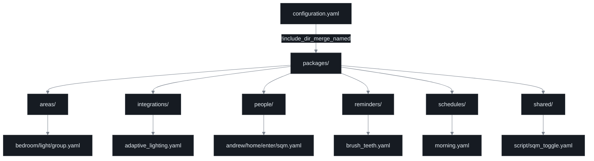
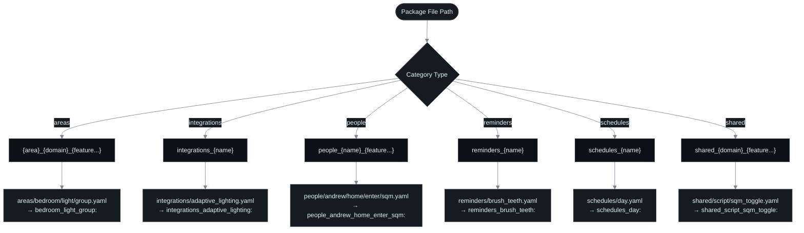
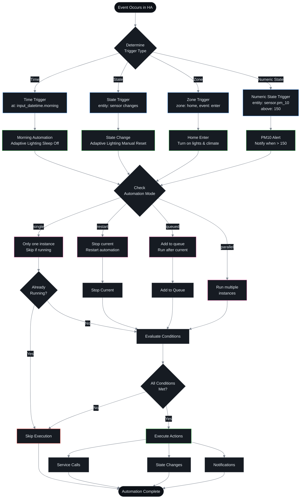

# Home Assistant Packages Automation Documentation

## Overview

This document provides comprehensive documentation for the Home Assistant packages automation system. The packages directory structure provides a modular, organized approach to managing automations, configurations, and entities across the entire Home Assistant installation.

Use this document as a deep reference. For day-to-day editing rules and validation workflow, start with `docs/structure-guidelines.md`. Package placement and naming in this repo follow the current six-directory taxonomy: `areas/`, `integrations/`, `people/`, `reminders/`, `schedules/`, and `shared/`.

## Table of Contents

1. [Architecture](#architecture)
2. [Package Organization](#package-organization)
3. [Naming Conventions](#naming-conventions)
4. [Automation Lifecycle](#automation-lifecycle)
5. [Trigger Types and Flow](#trigger-types-and-flow)
6. [Best Practices](#best-practices)
7. [Examples](#examples)
8. [Troubleshooting](#troubleshooting)

---

## Architecture

The Home Assistant packages system uses a hierarchical structure where `configuration.yaml` loads all package files, which are then merged by domain name to create a cohesive configuration.

### System Architecture Diagram



### Configuration Loading

In `configuration.yaml`, packages are loaded with a single directive:

```yaml
homeassistant:
  packages: !include_dir_merge_named packages/
```

This directive:

- Scans the entire `packages/` directory recursively
- Loads all `.yaml` files
- Merges configurations by their package name (root key in each YAML file)
- Allows multiple files to contribute to the same domain

---

## Package Organization

The packages directory is organized into six taxonomy directories:

### 1. Areas (`areas/`)

Area-scoped configuration such as per-room devices, automations, scripts, and helpers. Area packages typically follow a `{area}/{domain}/{feature}.yaml` layout.

### 2. Integrations (`integrations/`)

Integration-specific configuration for shared platforms and services such as `adaptive_lighting`, `google_assistant`, `esphome`, or tracking integrations.

### 3. People (`people/`)

Person-scoped configuration where helpers, automations, or scripts belong to a specific person rather than a room or global concern.

### 4. Reminders (`reminders/`)

Reminder and notification packages for recurring tasks and personal prompts.

### 5. Schedules (`schedules/`)

Time-of-day schedule anchors such as `morning`, `evening`, `night`, and other reusable scheduling helpers.

### 6. Shared (`shared/`)

Cross-cutting configuration that is not tied to one room or person, including shared scripts, presence logic, Lovelace packages, zones, and grouped devices.

Do not place new package files at the `packages/` root. Every package under `packages/` is loadable input through `!include_dir_merge_named`, so only create standalone package files inside the active taxonomy directories.

When automations, scripts, or integration logic need package-owned helpers, define the `input_*` blocks in a separate standalone package file rather than mixing them into the logic package. When one feature owns helpers across multiple input domains, prefer a feature-scoped `_input` package key such as `shared_background_music_input`.

---

## Naming Conventions

Package names follow a strict hierarchical pattern that maps directly to their file path.

### Naming Pattern Diagram



### Naming Rules

1. **No root-level packages**: Place all new package files under one of the six active taxonomy directories.

2. **Use snake_case**: All package names, IDs, and entity IDs use snake_case.
   - Consistent with Home Assistant conventions
   - Easy to read and maintain

3. **Use the taxonomy-specific prefix rule**: The package key should match the active directory convention.

- Area-based: `bedroom_light_group`
- Integration-based: `integrations_adaptive_lighting`
- People-based: `people_andrew_home_enter_sqm`
- Schedule-based: `schedules_day`
- Shared-based: `shared_script_sqm_toggle`
- Reminder-based: `reminders_brush_teeth`

4. **Keep package keys globally unique**: `!include_dir_merge_named` merges every YAML file under `packages/`, so duplicate top-level keys will collide.

### Naming Examples

| File Path                                                       | Package Name                               |
| --------------------------------------------------------------- | ------------------------------------------ |
| `packages/areas/bedroom/light/group.yaml`                       | `bedroom_light_group:`                     |
| `packages/integrations/adaptive_lighting.yaml`                  | `integrations_adaptive_lighting:`          |
| `packages/people/andrew/home/enter/sqm.yaml`                    | `people_andrew_home_enter_sqm:`            |
| `packages/reminders/brush_teeth.yaml`                           | `reminders_brush_teeth:`                   |
| `packages/schedules/day.yaml`                                   | `schedules_day:`                           |
| `packages/shared/script/sqm_toggle.yaml`                        | `shared_script_sqm_toggle:`                |

---

## Automation Lifecycle

Understanding how automations flow from configuration to execution is crucial for effective debugging and development.

### Lifecycle Sequence Diagram


### Lifecycle Phases

#### 1. Startup Phase

**Configuration Loading:**

- Home Assistant loads `configuration.yaml`
- Encounters `packages: !include_dir_merge_named packages/`
- Recursively scans all YAML files in `packages/`

**Package Merging:**

- Groups configurations by package name (root key)
- Merges multiple files that share the same package name
- Example: Multiple files can all contribute to the `automation:` domain

**Registration:**

- Each automation is registered with the Automation Engine
- Assigned a unique ID for tracking
- Mode is validated (single, restart, queued, parallel)
- Trigger monitors are set up

#### 2. Runtime Phase

**Trigger Monitoring:**

- Monitors continuously watch for trigger events
- Different platforms monitor different event types:
  - Time platform: Watches the clock
  - State platform: Monitors entity state changes
  - Zone platform: Tracks device location
  - Numeric state platform: Monitors sensor values

**Condition Evaluation:**

- When a trigger fires, all conditions are evaluated
- Must ALL pass for automation to proceed
- Common conditions:
  - State checks
  - Time windows
  - Numeric comparisons
  - Template evaluations

**Action Execution:**

- Services are called sequentially (unless parallel execution)
- Each action can:
  - Control devices
  - Change entity states
  - Send notifications
  - Call other scripts
  - Execute choose/if-then logic

**Completion:**

- Automation mode determines behavior after completion
- Logging and tracing are updated
- Ready for next trigger (based on mode)

---

## Trigger Types and Flow

Different trigger types have different behaviors and use cases. Understanding these helps design reliable automations.

### Trigger Flow Diagram



### Trigger Types

#### 1. Time Trigger

Executes at a specific time.

```yaml
trigger:
  - platform: time
    at: input_datetime.morning
```

**Use cases:**

- Morning routines
- Evening lighting changes
- Scheduled tasks

**Example:** `bedroom_bedtime`

- Triggers at bedtime
- Turns on air purifier in auto mode

#### 2. State Trigger

Executes when an entity changes state.

```yaml
trigger:
  - platform: state
    entity_id: light.bedroom
    from: 'off'
    to: 'on'
```

**Use cases:**

- Response to manual control
- Cascading automations
- Reset logic

#### 3. Zone Trigger

Executes when a device enters or leaves a zone.

```yaml
trigger:
  - platform: zone
    entity_id: device_tracker.pixel_6_pro
    zone: zone.home
    event: enter
```

**Use cases:**

- Arrival automations
- Departure routines
- Location-based triggers

**Example:** `shared_zone_home_enter`

- Turns on lights
- Enables climate control
- Activates humidifier

#### 4. Numeric State Trigger

Executes when a sensor crosses a threshold.

```yaml
trigger:
  - platform: numeric_state
    entity_id: sensor.bedroom_sen55_pm_10
    above: 150
```

**Use cases:**

- Environmental alerts
- Safety notifications
- Threshold-based actions

**Example:** `bedroom_pm_10`

- Alerts when PM10 exceeds 150 µg/m³
- Suggests running air purifier

### Automation Modes

#### single (Implicit default)

- Only one instance runs at a time
- New triggers are ignored while running
- Best for: Non-overlapping automations
- This mode is implicit in Home Assistant and is usually omitted from YAML.

#### restart

- Stops current execution
- Restarts from beginning
- Best for: Presence detection, motion lighting

```yaml
mode: restart
```

#### queued

- Queues new triggers
- Runs them sequentially
- Best for: Sequential tasks

```yaml
mode: queued
max: 5 # Maximum queue size
```

#### parallel

- Runs multiple instances simultaneously
- Best for: Independent actions per trigger

```yaml
mode: parallel
max: 10 # Maximum parallel instances
```

---

## Best Practices

### 1. File Organization

**Do:**

- Group related automations by area or domain
- Use descriptive filenames that match content
- Keep files small and focused (single responsibility)
- Keep package-owned `input_*` helpers in a separate standalone package file; use a feature-scoped `_input` name when one feature spans multiple input domains
- Move user-configurable values into helpers instead of hard-coding them in automation or script logic, and surface those helpers on the unified Configuration dashboard
- Use subdirectories for complex areas

**Don't:**

- Mix unrelated automations in one file
- Create deeply nested directory structures
- Use generic names like `automation1.yaml`
- Leave user-editable entity targets, schedules, thresholds, or toggles hard-coded in logic packages

### 2. Naming Conventions

**Do:**

- Use snake_case for all names
- Include context in names (area, domain, feature)
- Keep automation aliases descriptive
- Use unique, meaningful IDs

**Don't:**

- Use spaces or special characters
- Create ambiguous names
- Reuse IDs across automations

### 3. Automation Structure

**Do:**

- Add comments explaining complex logic
- Use descriptive aliases
- Include package path in comments
- Set appropriate mode for use case

**Don't:**

- Declare `mode: single` explicitly; it is implicit and usually omitted.
- Create empty conditions
- Put comments at the end of blocks

**Example:**

```yaml
# Package path: packages/areas/bedroom/pm_10.yaml
bedroom_pm_10:
  # Alerts when particulate matter exceeds the safe bedroom threshold.
  automation:
    - alias: 'Bedroom - PM10 Alert'
      id: bedroom_automation_pm_10
      description: 'Notify when bedroom SEN55 PM10 exceeds 150 ug/m3.'
      trigger:
        - platform: numeric_state
          entity_id: sensor.bedroom_sen55_pm_10
          above: 150
      action:
        - service: notify.mobile_app_pixel_6_pro
          data:
            title: 'Bedroom Air Quality'
            message: >-
              PM10 is {{ states('sensor.bedroom_sen55_pm_10') }} ug/m3.
              Consider running the air purifier.
```

### 4. Testing and Debugging

**Do:**

- Test automations after creation
- Use Developer Tools > States to check entity states
- Review `home-assistant.log` for errors
- Use `pnpm reload` to reload configurations

**Don't:**

- Deploy untested automations
- Ignore warnings in logs
- Skip validation before committing

### 5. Maintenance

**Do:**

- Document complex logic
- Keep related automations together
- Regularly review and clean up unused automations
- Version control your configuration

**Don't:**

- Leave commented-out code indefinitely
- Create duplicate automations
- Ignore deprecation warnings

---

## Examples

### Example 1: Time-Based Automation

**File:** `packages/areas/bedroom/bedtime.yaml`

**Package Name:** `bedroom_bedtime`

```yaml
bedroom_bedtime:
  automation:
    - trigger:
        platform: time
        at: input_datetime.bedroom_bedtime
      action:
        - service: fan.turn_on
          data:
            preset_mode: auto
          target:
            entity_id: fan.bedroom_air_purifier
      alias: 'Bedroom - Bedtime'
      id: bedroom_bedtime
```

**Purpose:** Turns on the bedroom air purifier in auto mode at bedtime.

**Key Points:**

- Uses `input_datetime` for configurable timing
- Simple single action
- No conditions needed
- Mode defaults to `single` in Home Assistant and is usually omitted

---

### Example 2: Numeric State Alert

**File:** `packages/areas/bedroom/pm_10.yaml`

**Package Name:** `bedroom_pm_10`

```yaml
bedroom_pm_10:
  # Alerts when particulate matter exceeds the safe bedroom threshold.
  automation:
    - alias: 'Bedroom - PM10 Alert'
      id: bedroom_automation_pm_10
      description: 'Notify when bedroom SEN55 PM10 exceeds 150 ug/m3.'
      trigger:
        - platform: numeric_state
          entity_id: sensor.bedroom_sen55_pm_10
          above: 150
      action:
        - service: notify.mobile_app_pixel_6_pro
          data:
            title: 'Bedroom Air Quality'
            message: >-
              PM10 is {{ states('sensor.bedroom_sen55_pm_10') }} ug/m3.
              Consider running the air purifier.
```

**Purpose:** Sends a mobile notification when PM10 levels exceed safe thresholds.

**Key Points:**

- Monitors air quality sensor
- Uses template in message for current value
- Add `for:` in the trigger when you need debounce behavior
- Clear, actionable message

---

### Example 3: Zone-Based Automation

**File:** `packages/shared/zone/home/enter.yaml`

**Package Name:** `shared_zone_home_enter`

```yaml
shared_zone_home_enter:
  automation:
    action:
      - choose:
          - conditions:
              - condition: state
                entity_id: input_select.bedroom_climate_zone
                state: 'Home'
            sequence:
              # Turn on the lights
              - service: light.turn_on
                target:
                  entity_id: light.bedroom_light_group_zigbee
              # Turn on the thermostat
              - service: climate.turn_on
                target:
                  entity_id: climate.bedroom_thermostat
              # Turn on the humidifier
              - service: humidifier.turn_on
                target:
                  entity_id: humidifier.bedroom_humidifier_virtual
    alias: Home - Andrew - Enter
    id: zone_home_andrew_enter
    trigger:
      - entity_id: device_tracker.pixel_6_pro
        event: enter
        platform: zone
        zone: zone.home
```

**Purpose:** When arriving home, activates bedroom climate and lighting.

**Key Points:**

- Zone trigger for location awareness
- Conditional logic with choose
- Multiple coordinated actions
- Respects climate zone preference

---

### Example 4: Conditional Time Automation

**File:** `packages/integrations/adaptive_lighting/sleep_mode/on/weekday.yaml`

**Package Name:** `integrations_adaptive_lighting_sleep_mode_on_weekday`

```yaml
integrations_adaptive_lighting_sleep_mode_on_weekday:
  automation:
    - action:
        - service: switch.turn_on
          target:
            entity_id: switch.adaptive_lighting_sleep_mode_common
      alias: Adaptive Lighting - Sleep Mode - On - Weekday
      condition:
        - condition: time
          weekday:
            - mon
            - tue
            - wed
            - thu
            - sun
      id: adaptive_lighting_sleep_mode_on_weekday
      trigger:
        - at: input_datetime.adaptive_lighting_sleep_mode_on_weekday
          platform: time
```

Pair `input_datetime.adaptive_lighting_sleep_mode_on_weekday` with a separate standalone input package, for example `integrations_adaptive_lighting_sleep_mode_on_weekday_input`, so the logic file stays focused on the automation.

**Purpose:** Enables adaptive lighting sleep mode on weekday evenings.

**Key Points:**

- Time-based trigger with weekday condition
- References a helper defined in a separate standalone input package
- Only runs on specified days
- Keeps the logic package focused on automation behavior

---

### Example 5: Reminder Automation

**File:** `packages/reminders/brush_teeth.yaml`

**Package Name:** `reminders_brush_teeth`

```yaml
reminders_brush_teeth:
  automation:
    - id: morning_brush_teeth_reminder
      alias: Morning Brush Teeth Reminder
      description: Reminds to brush teeth in the morning
      trigger:
        platform: time
        at: '07:00:00'
      condition:
        condition: state
        entity_id: input_boolean.brush_teeth_reminder
        state: 'on'
      action:
        - service: persistent_notification.create
          data:
            title: 'Morning Reminder'
            message: 'Time to brush your teeth!'
            notification_id: 'morning_brush_teeth_reminder'
        - service: notify.mobile_app_pixel_6_pro
          data:
            title: 'Morning Routine'
            message: "Don't forget to brush your teeth!"
            data:
              actions:
                - action: 'MARK_COMPLETE'
                  title: 'Mark as Complete'

    - id: evening_brush_teeth_reminder
      alias: Evening Brush Teeth Reminder
      description: Reminds to brush teeth in the evening
      trigger:
        platform: time
        at: '21:00:00'
      condition:
        condition: state
        entity_id: input_boolean.brush_teeth_reminder
        state: 'on'
      action:
        - service: persistent_notification.create
          data:
            title: 'Evening Reminder'
            message: 'Time to brush your teeth!'
            notification_id: 'evening_brush_teeth_reminder'
        - service: notify.mobile_app_pixel_6_pro
          data:
            title: 'Evening Routine'
            message: "Don't forget to brush your teeth!"
            data:
              actions:
                - action: 'MARK_COMPLETE'
                  title: 'Mark as Complete'
```

Define `input_boolean.brush_teeth_reminder` in a separate standalone input package, for example `reminders_brush_teeth_input`, instead of in the same file as the automations.

**Purpose:** Daily reminders for brushing teeth, morning and evening.

**Key Points:**

- Multiple automations in one package
- Toggle switch lives in a separate standalone input package
- Both persistent notifications and mobile notifications
- Actionable notifications
- Keeps helper ownership separate from automation logic

---

## Troubleshooting

### Common Issues

#### 1. Automation Not Firing

**Symptoms:**

- Trigger event occurs but automation doesn't run
- No errors in logs

**Diagnosis:**

1. Check automation is enabled in UI
2. Verify trigger entity exists and is correct
3. Test conditions manually in Developer Tools
4. Check automation mode isn't preventing execution
5. Review trace in Developer Tools > Automation

**Solutions:**

- Enable automation in UI
- Fix entity_id references
- Adjust conditions
- Change mode if needed

#### 2. Configuration Not Loading

**Symptoms:**

- Changes don't appear after reload
- Errors on startup

**Diagnosis:**

1. Check YAML syntax with online validator
2. Review `home-assistant.log` for errors
3. Verify package name is unique
4. Check for duplicate IDs

**Solutions:**

- Fix YAML syntax errors
- Rename conflicting packages
- Use unique IDs for all automations
- Run `pnpm reload` to see errors

#### 3. Automation Firing Too Often

**Symptoms:**

- Actions repeat unexpectedly
- Multiple notifications

**Diagnosis:**

1. Check automation mode
2. Review trigger conditions
3. Look for trigger loops (automation triggering itself)
4. Check for multiple automations with same trigger

**Solutions:**

- Use `mode: restart` or `mode: queued` when overlap must be controlled
- Add cooldown with `for:` in trigger
- Add conditions to prevent loops
- Consolidate duplicate automations

#### 4. Package Merge Conflicts

**Symptoms:**

- Some automations missing
- Unexpected behavior

**Diagnosis:**

1. Check for duplicate package names
2. Verify domain names are correct
3. Look for conflicting IDs

**Solutions:**

- Use unique package names
- Ensure package names follow conventions
- Use unique automation IDs

### Debugging Tools

#### Developer Tools

1. **States Tab:**
   - View current state of all entities
   - Check if sensors/switches are working

2. **Services Tab:**
   - Test service calls manually
   - Verify syntax before using in automation

3. **Automations Tab:**
   - View all automations
   - Enable/disable individual automations
   - Trigger manually for testing
   - View execution traces

#### Logs

Check `home-assistant.log` for:

- Syntax errors
- Runtime errors
- Automation triggers
- Service call failures

Enable debug logging in `packages/logger.yaml`:

```yaml
logger:
  logs:
    homeassistant.components.automation: debug
```

#### Reload Commands

Use `pnpm reload` to run:

```bash
npx hass-cli call homeassistant reload_all
```

This reloads:

- Automations
- Scripts
- Groups
- Input helpers
- And more

When migrating user-editable values from hard-coded YAML into new helpers, do not add helper `initial` values just to force the current setting into place. Reload the configuration, restart Home Assistant core if the brand-new helper entities do not register yet, seed the new helper state once with an explicit service call or committed manual migration script, then verify the resulting runtime state so later user edits continue to persist.

For the background music helper migration, use `script.background_music_seed_helper_defaults` once after the new helper entities exist. It seeds the legacy play target, stop target, and Monday-through-Friday schedule only when the target helpers are still blank, so later user edits are not overwritten. The live background music script and weekday automations intentionally fail closed until those helper values are populated, so run the seed script before expecting the schedule to resume on an existing install.

### Best Practices for Debugging

1. **Make small changes:** Test one thing at a time
2. **Use aliases:** Descriptive names help identify issues
3. **Add descriptions:** Document complex logic
4. **Test incrementally:** Verify each step works
5. **Review traces:** Use automation traces to see execution flow
6. **Check logs regularly:** Catch errors early
7. **Use version control:** Easy rollback if something breaks

---

## Additional Resources

### Home Assistant Documentation

- [Automations](https://www.home-assistant.io/docs/automation/)
- [Packages](https://www.home-assistant.io/docs/configuration/packages/)
- [Triggers](https://www.home-assistant.io/docs/automation/trigger/)
- [Conditions](https://www.home-assistant.io/docs/automation/condition/)
- [Actions](https://www.home-assistant.io/docs/automation/action/)

### Community Resources

- [Home Assistant Community Forum](https://community.home-assistant.io/)
- [Home Assistant Reddit](https://www.reddit.com/r/homeassistant/)
- [Home Assistant Discord](https://discord.gg/home-assistant)

### Tools

- **YAML Validators:**
  - [YAML Lint](http://www.yamllint.com/)
  - VS Code with Home Assistant extension

- **CLI Tools:**
  - `hass-cli` - Command-line interface for Home Assistant
  - `yamllint` - YAML linter

---

## Conclusion

The packages automation system provides a powerful, modular approach to Home Assistant configuration. By following the organizational patterns and naming conventions documented here, you can create a maintainable, scalable smart home setup.

Key takeaways:

- **Organize by purpose:** Use areas for location-based, domains for cross-cutting concerns
- **Follow naming conventions:** Consistent names make navigation easier
- **Keep it modular:** Small, focused files are easier to maintain
- **Document your work:** Comments and descriptions save time later
- **Test thoroughly:** Verify automations before deploying

Remember: Good organization at the start pays dividends as your system grows. Take time to structure your packages properly, and you'll thank yourself later.
